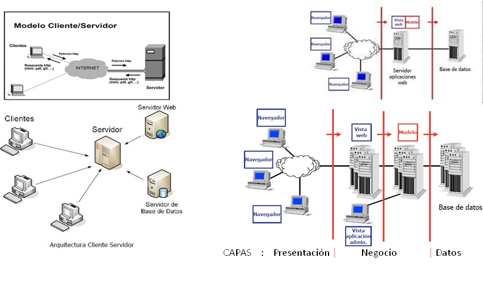
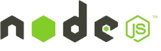

# UT1 SELECCIÓN DE ARQUITECTURAS Y HERRAMIENTAS DE PROGRAMACIÓN

## Conceptos básicos de Internet
* Es una gran red de ordenadores y como todas ellas  sirve para compartir recursos e intercambiar  información.
* Ordenadores unidos a través de conexiones de varios  tipos
* Se utiliza el protocolo TCP/IP
* Se ofrecen diferentes servicios a los usuarios: WWW,  FTP, DNS, e-mail, SSH, etc…
## Introducción

* Una web es un sistema formado por volúmenes de información organizados  mediante recursos web (enlaces, vínculos que permiten relacionarse entre  ellos…).
* Surge como idea original para la búsqueda de un sistema que permita  acceder rápidamente a documentos electrónicos mediante enlaces.
* Se utiliza un lenguaje denominado HTML (HyperText Markup Language)
* HTML es el lenguaje con el que se "escriben" la mayoría de páginas Web
* El lenguaje HTML es un estándar reconocido en todo el mundo y cuyas  normas define un organismo sin ánimo de lucro llamado [World Wide Web  Consortium](http://www.w3.org) más conocido como W3C.
* El software para comprender e interpretar la información en un documento  HTML se denomina navegador.

## Modelos de programación en entornos  cliente/servidor

## Generación dinámica de páginas web
Podemos dividir las __aplicaciones web__ en:
* __Estáticas__: el usuario recibe una página web cuya interacción no conlleva  ningún tipo de acción, ni en la propia página, ni genera respuesta  alguna por parte del servidor. Usan lenguaje HTML exclusivamente.
* __Dinámicas__: la interacción del cliente con el recurso recibido por parte  del servidor (página web) produce algún tipo de cambio en la  visualización del mismo (cambios de formato, ocultación de partes del  documento, creación de elementos nuevos, etc.). Los lenguajes  involucrados en este tipo de aplicaciones incluyen, entre otros, HTML,  CSS o JavaScript.
* __Interactivas__: la interacción hace que se genere un diálogo entre el  cliente y el servidor. Desde el punto de vista del modelo de  programación, la lógica asociada al inicio y gestión de dicho diálogo  puede ser ejecutada tanto en el cliente como en el servidor (e incluso en  ambos).
Las más demandadas actualmente son las interactivas. Las  tecnologías implicadas varían mucho en función de si son ejecutadas  en el lado del cliente o en el lado del servidor.
## Lenguajes de programación utilizados.  Lenguajes de scripting
Hay que diferenciar entre:
* Lenguajes de programación del lado del cliente.
* Lenguajes	de	programación	del	lado	del  lenguajes scripting.

## Del lado del cliente

* __HTML__: solo presenta texto en una página, además de definir algunos aspectos
visuales en el documento mediante el uso de estilos.
* __Hojas de estilo (CSS)__: definen reglas de representación del contenido en  colaboración con HTML.
* __JavaScript__: lenguaje de programación interpretado, permite el uso de efectos  visuales y nuevas interacciones con el usuario. Se usa habitualmente a través de  bibliotecas como jQuery, Angular o React.
* __XML__: lenguaje de programación auto descriptivo ampliamente utilizado para  el intercambio de datos entre aplicaciones multiplataforma.
* __JSON__: surge como el gran rival del XML ya que es más ligero y legible.
* __Applets__: programas desarrollados en Java (no recomendado).
* __ActiveX__: controles que tienen un comportamiento parecido a los applets pero  son desarrollados por Microsoft (no recomendado).
* __Adobe Flash__ (problemas de usabilidad).

## Lenguajes del lado del servidor
El	código	de	los	lenguajes	del	lado	del	servidor	es	ejecutado	por	un
software específico en el componente que actúa como servidor.
Existen múltiples alternativas:
* CGIs
* Lenguajes específicos para web: PHP
* Lenguajes dinámicos: Perl, Python, Ruby,…
* JavaScript en servidor: NodeJS
* Lenguajes generados compilados:
    * JVM: Java (JSP, Servlets, …), Scala, Groovy
    * CLR: C# (ASP.NET), …
* Otros: frameworks, CMS, etc.

## Lenguajes del lado del servidor
* __CGI__ (Common Gateway Interface), 1.1 (2004)
    * Método estándar para transmitir parámetros entre  servidor y programas ejecutables
    * Los programas CGIs son ejecutados por el servidor
    * Devuelve la respuesta de la ejecución
    * Problemas de escalabilidad y seguridad

*  __PHP__  
    * Lenguaje interpretado por el servidor
    * El código se incrusta en HTML mediante  marcas especiales
    * Cuando el servidor reconoce código  PHP:
        * Llama al intérprete
        * Ejecuta el código
        * Devuelve el resultado
    * Según [__w3techs__]  (https://w3techs.com/technologies/overview/programming_language/all), el 77% de los sitios web utiliza PHP

* __Lenguajes dinámicos__
    * Python, Ruby
    
    * Lenguajes interpretados de propósito general
    * Buenos frameworks y librerías para Web
        * Ruby: Ruby on Rails
        * Python: Django
  
  
* __JavaScript del lado del servidor__
    * Librería Node.js
        * Basado V8, el motor JavaScript de Google
        * Permite utilizar JavaScript en el servidor
        * Entrada/salida basada en eventos
        * Creciendo en popularidad

   
  