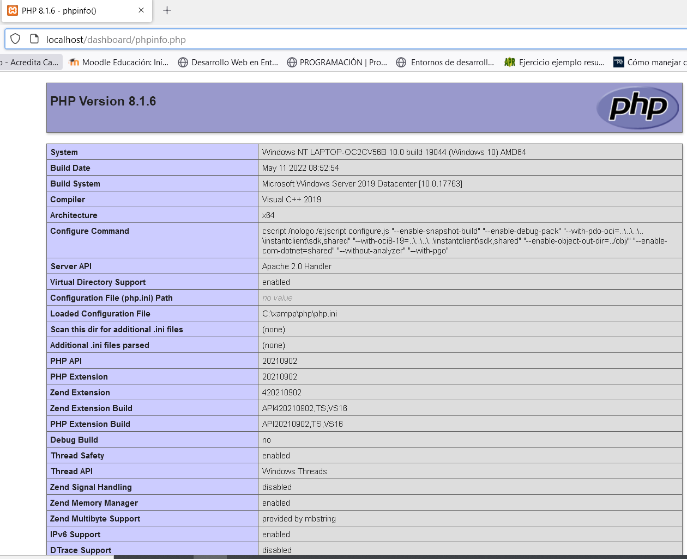

# UT2 INSERCIÓN DE CÓDIGO EN PÁGINAS WEB
## Índice
  - [Inserción de código de servidor](#inserción-de-código-de-servidor)
  - [Ámbito de ejecución](#ámbito-de-ejecución)
  - [PHP- Hypertext Preprocessor](#php--hypertext-preprocessor)
    - [Etiquetas de servidor](#etiquetas-de-servidor)
    - [Sintaxis básica](#sintaxis-básica)
    - [Comentarios:](#comentarios)
    - [Imprimir : echo y print](#imprimir--echo-y-print)
    - [variables y tipos de datos](#variables-y-tipos-de-datos)
    - [Expresiones y operadores](#expresiones-y-operadores)
    - [Precedencia de operadores ( de mayor a menor):](#precedencia-de-operadores--de-mayor-a-menor)
    - [Combinación de etiquetas html y código PHP](#combinación-de-etiquetas-html-y-código-php)
    - [Insertar etiquetas dentro de un script PHP](#insertar-etiquetas-dentro-de-un-script-php)
    - [Insertar todas las etiquetas dentro de un script PHP](#insertar-todas-las-etiquetas-dentro-de-un-script-php)
    - [Ámbito de las variables](#ámbito-de-las-variables)
    - [Cadenas de texto](#cadenas-de-texto)
      - [Concatenación de cadenas](#concatenación-de-cadenas)
    - [Funciones relacionadas con los tipos de datos](#funciones-relacionadas-con-los-tipos-de-datos)
    - [Variables especiales en PHP](#variables-especiales-en-php)

## Inserción de código de servidor

* Estructura páginas estáticas
  
  * Sencilla
  * Con tres partes:
    * Cabecera (definición directivas)
    * Zona metadatos
    * Cuerpo del documento (con la información a mostrar).
* Una vez creada la página se inserta el código a compilar e interpretar por el servidor.
* El código de servidor, se ejecutará al procesar la petición  HTTP del cliente.
   
## Ámbito de ejecución

* Los lenguajes de servidor sólo pueden tener acceso a los recursos alojados en el servidor o bien otros ofrecidos a través de la red.
* NO pueden acceder a recursos del propio cliente.
* Poseen archivos de configuración para definir el comportamiento de la aplicación (php.ini)
  


## PHP- Hypertext Preprocessor

* Lenguaje de código __abierto__
* Permite su uso junto con documentos HTML mediante la __inserción de fragmentos__ de código PHP acotados por etiquetas especiales
* El código PHP es __interpretado__ por el servidor web donde se aloja el documento y se genera el correspondiente código HTML para mostrar por el navegador
* Las páginas tienen __extensión *.php__
* Tiene una interfaz de desarrollo basada en la __POO__
* Es compatible con diferentes tecnologías
* Admite los principales servidores web y soporte con __diferentes repositorios de BD__ (para MySQL posee librerías específicas)

### Etiquetas de servidor

* PHP es sensible a las mayúsculas
  
<div class="page"/>

* La incrustación de código PHP en HTML se puede hacer de varias maneras:
    * Forma a)(compatible con todas las plataformas)
  
```php
    
         <?php
            ...
        ?>
``` 
  
    * Forma b)
```php
        <?
            ...
         ?>
``` 
    * Forma c)
```html
  	<script language=“php”>  …… </script>
```
    * Forma d)	
```php
        <%
            ...
         %>
```

  * Sólo la forma a) es compatible y portable con todas las plataformas, el resto requiere hacer ajustes adicionales en el fichero de configuración.
* Ejemplo
  
```html
<!DOCTYPE html>
<html>
    <head>
        <meta charset="UTF-8">
        <title>
            Desarrollo web
        </title>
    </head>
    <body>
        <h1>Desarrollo en servidor</h1>
        <h2> estas líneas están escritas en HtML</h2>
        <p> esta es una línea incluida en el cuerpo de la página</p>
```
```php
        <?php
            $expresion="1";
            if ($expresion =="1"){
                print("1.- Empiezan líneas generadas por PHP <br>");
                print("2.- El texto está por instrucción print de PHP");
            }
        ?>
``` 
```html
    </body>
<html>
``` 
* Ejercicio : Realiza una página web que presente como título "Mi primer ejemplo"  y un mensaje de texto "primer ejemplo", mediante etiquetas HTML y un mensaje "¡ Hola mundo !" con un script php  

### Sintaxis básica

* Es sensible a las mayúsculas
* Los espacios en blanco dentro del código embebido no tienen ningún efecto 
* El final de instrucción se indica con ;
* Los scripts embebidos pueden situarse en cualquier parte código HTML. 
* El número de scripts es indefinido.
* Cuando se ejecuta un código embebido, el script se sustituye por el resultado de dicha ejecución, incluidas las etiquetas de inicio y fin.
   
```html
<!DOCTYPE html>
<html>
``` 
```php
        <?php

            $salida="contenido php";
            
        ?>
``` 
```html
    <head>
        <meta charset="UTF-8">
        <title>
```   

```php
        <?php
            echo $salida;
        ?>
```
```html
        </title>
    </head>
    <body>
        <h1>Otro ejemplo</h1>
        <h2>
```     
```php
        <?php
            echo $salida;
        ?>
```
```html
        </h2>
    </body>
<html>
```
### Comentarios:

  * Comentarios de __una línea__ utilizando //
  * Comentarios de __una línea__ utilizando #
  * Comentarios de __varias líneas__. /* ….. */
  
### Imprimir : echo y print

* echo: muestra __una o más cadenas__ 
  
```php 
	echo cadena1 [, cadena2...]; 
```
Ejemplo
```php 
    echo "Hola Mundo";
	echo "Hola", "Mundo"; 
```
* print: muestra __una cadena__
```php 
	print cadena ; 

```
<div class="page"/>

Ejemplo
```php 
	print "Hola mundo"; 
    print "Hola "."mundo";
```
### variables y tipos de datos 

* El tipo de una variable no se suele especificar.
```php 
	$mi_variable = 7; 
```

* Se decide en tiempo de ejecución en función del contexto y puede variar. 
```php
	$mi_variable=7;
	$mi_variable="cambio de tipo";
```
* Reglas para nombrar una variable en PHP:
  * El nombre debe comenzar con una __letra__ o con un __guión bajo__ (“_”)
  * El nombre únicamente puede contener __caracteres alfanuméricos__ y __guiones bajos__.
  * El nombre de una variable __no__ debe contener espacios en blanco. Si queremos formar el nombre de una variable con más de una palabra lo que se suele hacer es utilizar un __guión bajo entre ellas__ (\$mi_variable) o poner __la primera letra de cada palabra en mayúsculas__ (\$miVariable)
* tipos de datos:
  *  __booleano__ (boolean): sus posibles valores son true y false. Además, cualquier número entero se considera como true, salvo el 0 que es false.
  * __entero__ (integer): cualquier número sin decimales. Se pueden representar en formato decimal, octal (comenzando por un 0), o hexadecimal (comenzando por 0x).
  * __real__ (float): cualquier número con decimales. Se pueden representar también en notación científica. 
  * __cadena__ (string): conjuntos de caracteres delimitados por comillas simples o dobles.
  * __null__: es un tipo de datos especial, que se usa para indicar que la variable no tiene valor.

Ejercicios:
1. Comprueba el resultado de las siguientes expresiones visualizando por pantalla su valor:
```php 
	$mi_booleano = false;
    $mi_entero= 0x2A;
    $mi_real=7.3e-1;
    $mi_cadena="texto";
    $mi_variable=null; 
```
2. ¿De qué tipo es la variable $resultado después de su ejecución?. Compruébalo visualizando su valor por pantalla:
```php 
    $mi_entero= 3;
    $mi_real=2.3;
    $resultado=$mi_entero+$mi_real; 
```
### Expresiones y operadores

* Operadores __aritméticos__: +, -, *, /, %, ++, --
* Operador de __asignación__: =
* Operadores de __comparación__: ==, !=, <, >, <=, >= 
* Operador de __control de error__: @. Antepuesto a una expresión, evita cualquier mensaje de error que pueda ser generado por la expresión.
* Operadores __lógicos__: and (&&), or (||), !, xor 
* Operadores de __cadena__: 
  * concatenación: . (punto) 
  * asignación con concatenación: .= 

### Precedencia de operadores ( de mayor a menor):

* ++,-- (operadores unarios)
* *, /, %
* +, -
* <, <=, >, <=
* ==, !=
* &&
* ||
* and
* or

### Combinación de etiquetas html y código PHP

```html
<!DOCTYPE html>
<html>
    <head>
        <meta charset="UTF-8">
        <title>
           Hola mundo
        </title>
    </head>
    <body>
        <h1>
```
```php
        <?php
            echo "Hola mundo";
        ?>
``` 
```html
        </h1>
    </body>
<html>
``` 
### Insertar etiquetas dentro de un script PHP

```html
<!DOCTYPE html>
<html>
    <head>
        <meta charset="UTF-8">
        <title>
           Hola mundo
        </title>
    </head>
    <body>        
```
```php
        <?php
            echo "<h1> Hola mundo </h1>";
        ?>
```
```html
    </body>
<html>
```
### Insertar todas las etiquetas dentro de un script PHP

```php
        <?php
            print ("<!DOCTYPE html>");
            print ("<html>");
            print ("<head>");
            print ("<title> hola mundo</title>");
            print ("</head>");
            print ("<body>");
            print ("<h1>Hola mundo</h1>");
            print ("</body>");
            print ("</html>");
        ?>
```
:computer:Hoja02_PHP_01

### Ámbito de las variables

* Se pueden utilizar en cualquier lugar del programa.
* Si la variable no existe se reserva espacio en memoria.
* Si una variable se define dentro de una función es una __variable local__ a la función.
* Si aparece fuera de la función se considera distinta a la definida en la función.
* Si dentro de una función se quiere usar una variable definida fuera hay que usar la palabra __global__.
* Si se quiere mantener el valor de una función declara dentro al salir de esta, se debe definir como __static__.

### Cadenas de texto

* Se definen tanto con comillas simples como dobles.
* Cuando se pone una variable dentro de unas comillas dobles, se procesa y se sustituye por su valor.
```php
        <?php
            $modulo="DWES";
            echo "<p> Módulo: $modulo </p>";
        ?>
```        
* PHP al encontrar la variable la sustituye por DWES. 
* Para que PHP distinga correctamente el texto que forma la cadena del nombre, a veces es necesario encerrarla __entre llaves__
```php
        <?php
            echo "<p> Módulo: ${modulo} </p>";
        ?>
```        
#### Concatenación de cadenas

* Concatenación punto (.)
* Operador de asignación y concatenación (.=) concatena al argumento del lado izquierdo la cadena del lado derecho.
```php
        <?php
            $a="Módulo ";
            $b= $a."DWES";
            //ahora $b contiene "Módulo DWES"
            $a .="DWES";
            // ahora $a también contiene "Módulo DWES"
        ?>
```        
<div class="page"/>

### Funciones relacionadas con los tipos de datos

* Funciones para comprobar y establecer el tipo de datos de una variable
  * __gettype( )__: obtiene el tipo de variable
```php
    gettype($variable);
```
  * __settype( )__: convierte una variable al tipo indicado por parámetro.
```php
    settype($variable,”float”);
``` 
  * Funciones para comprobar si es de un tipo concreto:
    * __is_array( )__, __is_bool( )__, __is_float( )__, __is_integer( )__….
    * __isset( )__: indica si una variable está definida y no es null.
```php  
    isset($variable);
```
  * __unset ( )__: destruye una variable.
```php
    unset($variable);
```
:computer:Hoja02_PHP_02

  * __Fechas__: no hay un tipo especifico. La información fecha y hora se almacena como un número entero y hay una serie de funciones en PHP para trabajar con ellas:
    * __date( )__ es una de las más útiles. Permite obtener una cadena de texto a partir de una fecha y hora con el formato que se elija.
```php 
	    date (string $formato [, int $fechahora]);
```  
   Si no se indica el segundo parámetro se utiliza la hora actual.
    * __date_default_timezone_set__ establece la zona horaria donde me encuentro.
```php 
	date_default_timezone_set(‘Europe/Madrid’);
```  
    * __getdate( )__ devuelve un array con información sobre la fecha y hora actual.

:computer:Hoja02_PHP_03

### Variables especiales en PHP

* PHP incluye variables internas predefinidas que pueden usarse desde cualquier ámbito. Se denominan __superglobales__.
* Cada una de estas variables es un array que contiene un conjunto de valores. Son las siguientes:
  * __$_SERVER__: contiene información sobre el entorno del servidor web y de ejecución. 
  * __$_GET, $_POST y $_COOKIE__: contienen las variables que se han pasado al guión actual utilizando respectivamente los métodos GET (parámetros en la URL), HTTP POST y Cookies HTTP.
  * __$_REQUEST__: junta en uno solo el contenido de los tres arrays anteriores.
  * __$_ENV__: contiene las variables que se puedan haber pasado a PHP desde el entorno en que se ejecuta.
  * __$_FILES__: contiene los ficheros que se puedan haber subido al servidor utilizando el método POST.
  * __$_SESSION__: contiene las variables de sesión disponibles para el guión actual.

