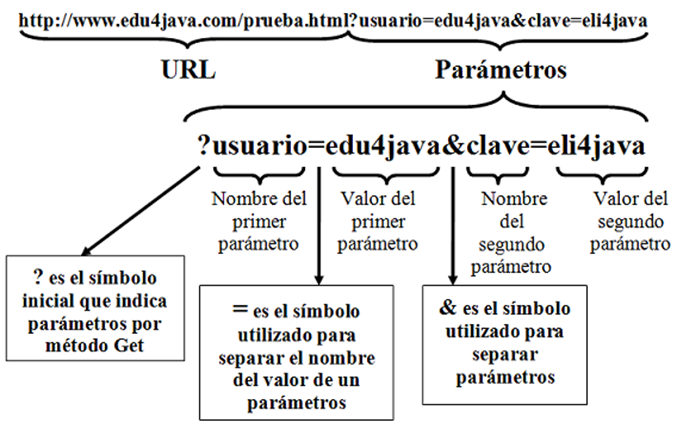

# UT3 PROGRAMACIÓN BASADA EN LENGUAJES DE MARCAS CON CÓDIGO EMBEBIDO

## Índice

  - [Estructuras de control](#estructuras-de-control)
    - [Sentencias condicionales](#sentencias-condicionales)
    - [Sentencias repetitivas o bucles](#sentencias-repetitivas-o-bucles)
  - [Funciones](#funciones)
    - [Inclusión de las funciones en ficheros externos](#inclusión-de-las-funciones-en-ficheros-externos)
    - [Creación y ejecución de funciones](#creación-y-ejecución-de-funciones)
    - [Argumentos en las funciones](#argumentos-en-las-funciones)
  - [Tipos de datos compuestos](#tipos-de-datos-compuestos)
    - [Arrays](#arrays)
      - [Recorrer un array](#recorrer-un-array)
    - [Objetos](#objetos)
      - [Creación de clases en PHP](#creación-de-clases-en-php)
      - [Métodos get y set](#métodos-get-y-set)
      - [Operador this](#operador-this)
      - [Constantes](#constantes)
      - [Métodos estáticos](#métodos-estáticos)
      - [Constructores](#constructores)
      - [Utilización de objetos](#utilización-de-objetos)
      - [Herencia](#herencia)
      - [Interfaces](#interfaces)
  - [Funciones relacionadas con los tipos de datos completos](#funciones-relacionadas-con-los-tipos-de-datos-completos)
  - [Formularios](#formularios)
    - [Métodos GET y POST](#Métodos-get-y-post)
      - [Método GET](#método-get)
      - [Método POST](#método-post)
    - [Recuperación de información](#recuperación-de-información)
      - [Con GET](#con-get)
      - [Con POST](#con-post)
    - [Validación de datos](#validación-de-datos)
## Estructuras de control

son de dos tipos:
* Condicionales
* Repetitivas o bucles

### Sentencias condicionales

* __if /elseif /else__: definir una expresión para ejecutar o no la sentencia o conjunto de sentencias siguientes
```php
<?php
    if ($a<$b)
        print "a es menor que b";
    elseif ($a>$b)
        print "a es mayor que b";
    else
        print "a es igual a b";
?>
```
> no es necesario poner {} porque solo ejecuta una sentencia en cada caso
* __switch__: similar a enlazar varias sentencias if comparando una misma variable con diferentes valores
  
```php
<?php
    switch ($a){
        case 0:
            print " a vale 0";
            break;
        case 1:
            print " a vale 1";
            break;
        default:
            print "a no vale 0 ni 1";
    }
?>
```
### Sentencias repetitivas o bucles

* __while:__:define un bucle que se ejecuta mientras se cumpla una expresión. La expresión se evalúa antes de comenzar cada ejecución del bucle. 
  
```php
<?php
    $a=1;
    while ($a <8)
        $a+=3;
    print $a // el valor obenido es 10
    
?>
```
> no es necesario poner {} porque solo ejecuta una sentencia 

* __do ... while__:similar al bucle while, pero la expresión se evalúa al final, con lo cúal se asegura que la sentencia/as del bucle se ejecutan al menos una vez.
  
```php
<?php
    $a=1;
    do 
        $a -=3;
    while ($a >10)
    print $a; // el valor obtenido es -2
?>
``` 
> no es necesario poner {} porque solo ejecuta una sentencia 

* __for__:compuesto por tres expresiones:
sintaxis
```php
    for(expr1;expr2;expr3){
        sentencia o conjunto de sentencias
    }
``` 
1. expr1: se ejecuta una vez al comienzo del bucle.
2. expr2: se evalúa para saber si se debe ejecutar o no la/as sentencia/as
3. expr3: se ejecuta tras ejecutar todas las sentencias del bucle
```php
<?php
    for ($a=5;$a<10;$a+=3){
        print $a // se muestran los valores 5 y 8
        print "<br/>";
    }    
?>
``` 
:computer: Hoja03_PHP_01

## Funciones

* Permiten __asociar una etiqueta__ (el nombre de la función) con un bloque de código a ejecutar. 
* Al usar funciones estamos ayudando a __estructurar mejor el código__. 
* Las funciones permiten crear variables locales que no serán visibles fuera del cuerpo de las mismas. 

### Inclusión de las funciones en ficheros externos

En ocasiones resulta más cómodo agrupar las funciones en ficheros externos al que se hará referencia.

Formas de incorporar ficheros externos:
* __include__: evalúa el contenido del fichero que se indica y lo incluye como parte del fichero actual en el punto de realización de la llamada. Se puede indicar la ruta de forma absoluta o de forma relativa. Se toma como base la ruta que se especifica en la directiva include_path del fichero php.ini, si no se encuentra en esa ubicación, se buscará en el directorio actual
  
* __include_once__: si por equivocación incluyes más de una vez un mismo fichero, lo normal es que obtengas algún tipo de error (por ejemplo, al repetir una definición de una función) 
  
* __require__: si el fichero que queremos incluir no se encuentra, include da un aviso y continua la ejecución del guión. La diferencia más importante al usar require es que en ese caso, cuando no se puede incluir el fichero, se detiene la ejecución del guion.
   
* __require_once__: es la combinación de las dos anteriores. 

Ejemplo
```php
<?php
   include 'funciones.inc.php';
   print fecha();
?>
``` 
### Creación y ejecución de funciones
Para crear tus propias funciones se usa la palabra __function__

```php
<?php
   function precio_con_iva(){
        global $precio;
        $precio_iva=$precio*1.21;
        print "el precio con IVA es ".$precio_iva;
   }
   $precio=10;
   precio_con_iva();
?>
``` 
No es necesario definir las funciones antes de usarlas excepto cuando están definidas condicionalmente:
```php
<?php
    $iva=true;
    $precio =10;
    precio_con_iva();// Da error, pues aquí aún no está definida 
    if ($iva){
        function precio_con_iva(){
            global $precio;
            $precio_iva=$precio*1.21;
            print "el precio con IVA es ".$precio_iva;
        }
    }
    precio_con_iva(); // aquí ya no da error
?>
``` 
### Argumentos en las funciones

* Siempre es mejor utilizar __argumentos o parámetros al hacer la llamada__. Además, en lugar de mostrar el resultado en pantalla o guardar el resultado en una variable global, las funciones pueden __devolver un valor usando la sentencia return__. 
* Cuando en una función se encuentra una sentencia return, termina su procesamiento y devuelve el valor que se indica 
```php
<?php
    function precio_con_iva($precio){
        return $precio*1.21;
    }
    $precio=10;
    $precio_iva=precio_con_iva($precio);
    print "el precio con IVA es ".$precio_iva;
?>
``` 
* Al definir la función, puedes indicar __valores por defecto__ para los argumentos, de forma que cuando hagas una llamada a la función puedes no indicar el valor de un argumento; en este caso se toma el valor por defecto indicado. 
  
```php
<?php
    function precio_con_iva($precio,$iva=0.21){
        return $precio*(1+$iva);
    }
    $precio=10;
    $precio_iva=precio_con_iva($precio);
    print "el precio con IVA es ".$precio_iva;
?>
``` 
* Los argumentos anteriores se pasaban __por valor__. Esto es, cualquier cambio que se haga dentro de la función a los valores de los argumento no se reflejará fuera de la función. 
* Si quieres que esto ocurra debes definir el parámetro para que su valor se pase __por referencia__, añadiendo el símbolo __& antes de su nombre__. 
  
```php
<?php
    function precio_con_iva(&$precio,$iva=0.21){
        return $precio*(1+$iva);
    }
    $precio=10;
    precio_con_iva($precio);
    print "el precio con IVA es ".$precio."<br/>";
?>
``` 
:computer: Hoja03_PHP_02

<div class="page"/>

## Tipos de datos compuestos

Un tipo de datos compuesto es aquel que te permite almacenar más de un valor. En PHP puedes utilizar dos tipos de datos compuestos: el array y el objeto.

### Arrays

 __Un array__ es un tipo de datos que nos permite almacenar varios valores. Cada miembro del array se almacena en una posición a la que se hace referencia utilizando un valor clave. Las claves pueden ser numéricas o asociativas.

```php
<?php
   //array numérico
   $modulos1=array(0=>"Programación",1=>"Base de datos",....,9=>"Desarrollo web en entorno servidor");

   //array asociativo
   $modulos2=array("PR"=>"Programación","BD"=>"Base de datos",...,"DWES"=>"Desarrollo web en entorno servidor");
?>
``` 
* la función __print_r__, nos muestra todo el contenido del array que le pasamos.
* Para hacer referencia a los elementos almacenados en un array, hay que utilizar el valor clave entre corchetes:  

```php

$modulos1[9];
$modulos2["DWES"];

``` 
* En PHP se pueden crear arrays de varias dimensiones almacenando otro array en cada uno de los elementos de un array.
```php
<?php
   
   $ciclos=array(
    "DAW"=>array("PR"=>"Programación","BD"=>"Base de datos",...,"DWES"=>"Desarrollo web en entorno servidor"),
    "DAM"=>array("PR"=>"Programación","BD"=>"Base de datos",...,"AD"=>"Acceso a datos")
   );
?>
``` 
* Para hacer referencia a los elementos almacenados en un array multidimensional, hay que indicar las claves para cada una de las dimensiones:
  
```php
$ciclos["DAW"]["DWES"];

``` 
* No hay que indicar el tamaño del array para crearlo. Ni siquiera es necesario indicar que una variable concreta es de tipo array:

```php
$modulos1[0]="Programación";
$modulos1[1]="Base de datos";
$modulos1[9]="Desarrollo web en entorno servivor";

``` 
* Ni siquiera es necesario especificar el valor de la clave. Si se omite, el array se irá llenando a partir de la última clave numérica existente, o de la posición 0 si no existe ninguna:

```php
$modulos1[]="Programación";
$modulos1[]="Base de datos";
$modulos1[]="Desarrollo web en entorno servivor";

``` 
#### Recorrer un array 

Las cadenas de texto o strings se pueden tratar como arrays en los que se almacena una letra en cada posición, siendo 0 el índice correspondiente a la primera letra, 1 el de la segunda, etc.

```php
$modulo = "Desarrollo web en entorno servidor";
// $modulo[3] == "a";
``` 
Para recorrer un array se puede utilizar __el bucle foreach__. Utiliza una variable temporal para asignarle en cada iteración el valor de cada uno de los elementos del arrays. Puedes usarlo de dos formas.
*  Recorriendo sólo los elementos:

```php
foreach ($modulos1 as $modulo)
		echo $modulo . "<br/>";

``` 
* O recorriendo los elementos y sus valores clave de forma simultánea:

```php
foreach ($modulos2 as $codigo => $modulo)
		echo "El código del módulo ".$modulo." es ".$codigo."<br/";
``` 
:computer: Hoja03_PHP_03

### Objetos

el lenguaje PHP original no se diseñó con características de orientación a objetos

Las características de POO que se soportan a partir de la versión PHP 5 incluyen:
* Métodos estáticos
* Métodos constructores y destructores
* Herencia
* Interfaces
* Clases abstractas

No se incluye:
* Herencia múltiple (Java NO tiene)
* Sobrecarga de métodos (Java SÍ tiene)
* Sobrecarga de operadores (Java NO tiene)

#### Creación de clases en PHP

La declaración de una clase en PHP se hace utilizando la palabra __class__. A continuación y entre llaves, deben figurar los miembros de la clase. Conviene hacerlo de forma ordenada, primero las propiedades o atributos, y después los métodos, cada uno con su código respectivo.
```php
    class Producto{
        private $codigo;
        public $nombre;
        protected $PVP;
        public function muestra(){
            return "<p>".$this->codigo."</p">;
        }
    }
```
En el ejemplo hemos puesto para recordar los principales niveles de acceso de los atributos, recordar que por lo general los atributos deben ser privados

> Recomendaciones:
> * Cada clase en un fichero distinto
> * Los nombres de las clases deben comenzar por mayúsculas para distinguirlos de los objetos y otras variables

Una vez definida la clase, podemos usar la palabra __new__ para instanciar objetos de la siguiente forma:
```php
$p = new Producto();
```
Para que la línea anterior se ejecute sin error, previamente debemos haber declarado la clase Para ello, en ese mismo fichero tendrás que incluir la clase poniendo algo como:
```php
require_once('producto php');
```
Para acceder desde un objeto a sus atributos o a los métodos de la clase, debes utilizar el __operador flecha__ (sólo se pone el símbolo $ delante del nombre del objeto)

```php
$p->nombre ="Samsung Galaxy S 20";
echo $p->muestra();
```
Ejercicio: Crea la clase Producto con los atributos que consideres necesarios.

#### Métodos get y set 

Aunque no es obligatorio, el nombre del método que nos permite obtener el valor de un atributo suele empezar por get y el que nos permite modificarlo por set

```php
private $codigo

public function setCodigo ($nuevo_codigo)
    {
        $this->codigo =$nuevo_codigo;
        
    }
public function getCodigo() {return $this->codigo;}
```
Ejercicio: crea los métodos get y set para la clase Producto creada por ti.

Desde PHP 5 se introdujeron los llamados __métodos mágicos__ entre ellos **__set** y **__get** Si se declaran estos dos métodos en una clase, PHP los invoca automáticamente cuando desde un objeto se intenta usar un atributo no existente o no accesible

Por ejemplo, el código siguiente simula que la clase Producto tiene cualquier atributo que queramos usar:

```php
class Producto
{
    private $atributos =array();
    public function __get($atributo){
        return $this->atributos[$atributo];
    }
    public function __set($atributo,$valor){
        $this->atributos[$atributo] = $valor;
    }
}
```
Ejercicio: comenta los métodos get y set que has hecho y añade los mágicos

#### Operador this

Cuando desde un objeto se invoca un __método de la clase__ a éste se le pasa siempre una referencia al objeto que hizo la llamada. Esta referencia se almacena en la variable __$this__.

Se utiliza, por ejemplo, en el código anterior para tener acceso a los __atributos privados del objeto__ (que
sólo son accesibles desde los métodos de la clase).

```php
print "<p>". $this->codigo ."</p";

```

#### Constantes

Además de métodos y propiedades, en una clase también se pueden definir __constantes__ utilizando la palabra __const__.

No hay que confundir los atributos con las constantes Son conceptos distintos las constantes no pueden cambiar su valor ( de ahí su nombre), no usan elcarácter __$__ y está asociado a la clase, es decir, no existe una copia del mismo en cada objeto.

Por tanto, para acceder a las constantes de una clase, se debe utilizar el nombre de la clase y el operador __::__ llamado __operador de resolución de ámbito__ (que se utiliza para acceder a los elementos de una clase).

```php
class BaseDatos{
    const USUARIO = "dwes";
    ...
}

echo BaseDatos::USUARIO;
```
No es necesario que exista ningún objeto de una clase para poder acceder al valor de las constantes que defina.
Además, sus nombres suelen escribirse en mayúsculas.

Ejercicio: crea una clase BaseDatos que tendrá como constantes el dominio donde está alojada, el usuario y la contraseña y la base de datos a utilizar.
<div class="page"/>

#### Métodos estáticos

Una clase puede tener atributos o métodos estáticos también llamados a veces atributos o métodos de clase. Se definen utilizando la palabra clave __static__

```php
class Producto{
    private static $num_productos = 0;
    public static function nuevoProducto(){
        self::$num_productos++;
    }
…
}
```
Los atributos y métodos estáticos __no__ pueden ser llamados desde un objeto de la clase utilizando el operador ->.

* Si el método o atributo es público , deberá accederse utilizando el nombre de la clase y el operador de resolución de ámbito.

```php
    Producto:: nuevoProducto();
```
* Si es privado , como el atributo $num_productos en el ejemplo anterior, sólo se podrá acceder a él desde los métodos de la propia clase, utilizando la palabra __self__ . De la misma forma que $this hace referencia al objeto actual, self hace referencia a la clase actual.

```php
    self:: $num_productos++;
```
#### Constructores

Desde PHP 7 puedes definir en las clases métodos constructores, que se ejecutan cuando se crea el objeto. El constructor de una clase debe llamarse __construct__. Se pueden utilizar, por ejemplo, para asignar valores a atributos.

```php
class Producto{
    private static $num_productos = 0;
    private $codigo;
    public function __construct(){
        self:: $num_productos++;
    }
…
}

```
El constructor de una clase puede llamar a otros métodos o tener parámetros, en cuyo caso deberán pasarse cuando se crea el objeto.

Sin embargo, __sólo puede haber un método constructor en cada clase__

```php
class Producto{
    private static $num_productos = 0;
    private $codigo;
    public function __construct($codigo){
        $this->$codigo = $codigo;
        self:: $num_productos++;
    }
…
}

```
Ejercicio: Crea un constructor para vuestra clase Producto.

También es posible definir un método destructor, que debe llamarse **__destruct** y permite definir acciones que se ejecutarán cuando se elimine el objeto.

```php
class Producto{
    private static $num_productos = 0;
    private $codigo;
    public function __construct($codigo){
        $this->$codigo = $codigo;
        self:: $num_productos++;
    }
    public function __destruct(){
        self::$num_productos--;
    }
…
}
$p = new Producto('Iphone');
```
:computer: Hoja03_PHP_04

#### Utilización de objetos

Una vez creado un objeto, puedes utilizar el operador instanceof para comprobar si es o no una instancia de una clase determinada.

```php
if ($p instanceof Producto){
    ...
}
```
Desde PHP7 se incluyen una serie de funciones útiles para el desarrollo de aplicaciones utilizando POO.

| Función | Ejemplo | Significado |
| ------------- | ------------------------------ | ---------------------------------- |
| __get_class__  | echo "La clase es:".get_class($p);  |Devuelve el nombre de la clase del objeto |
| __class_exists__  | if (class_exits('Producto')) <br/>{ $p= new Producto(); ...}  | Devuelve true si la clase está definida o false en caso contrario |
| __get_declared_classes__  | print_r(get_declared_classes());  | Devuelve un array con los nombres de las clases definidas |
| __class_alias__ | class_alias('Producto','Articulo');<br/> $p = new Articulo(); | Crea un alias para una clase |
| __get_class_methods__  | print_r(get_class_methods('Producto'));  | Devuelve un array con los nombres de los métodos de una clase que son accesibles desde donde se hace la llamada |
|__method_exists__ | if (method_exists('Producto','vende')){ ....}| Devuelve true si existe el método en el objeto o la clase que se indica, o false en caso contrario, independientemente de si es accesible o no|
|__get_class_vars__| print_r(get_class_vars('Producto'));| Devuelve un array con los nombre de los atributos de una clase que son accesibles desde dónde se hace la llamada|
|__get_object_vars__| print_r(get_object_vars($p));|Devuelve un array con los nombres de los atributos de un objeto que son accesibles desde dónde se hace la llamada|
|__property_exits__ | if(property_exists('Producto','codigo')){...}|Devuelve true si existe el atributo en el objeto o la clase que se indica, o false en caso contrario, independientemente de si es accesible o no|

Desde PHP5, puedes indicar en las funciones y métodos de qué clase deben ser los objetos que se pasen como parámetros. Para ello, debes especificar el tipo antes del parámetro.

```php
public function vendeProducto( Producto $p){
    ...
}
```
Si cuando se realiza la llamada, el parámetro no es del tipo adecuado, se produce un error que se podría capturar.

Pregunta: ¿Qué sucede al ejecutar el siguiente código?

```php
$p = new Persona();
$p->nombre ='Pepe';
$a=$p;

```
Desde PHP5 El código anterior simplemente crearía un __nuevo identificador del mismo objeto__. Esto es, en cuanto se utilice uno cualquiera de los identificadores para cambiar el valor de algún atributo, este cambio se vería también reflejado al acceder utilizando el otro identificador. Aunque haya dos o más identificadores del mismo objeto, en realidad todos se refieren a la única copia que se almacena del mismo. Tiene un comportamiento similar al que ocurre en Java.

Si necesitas __copiar un objeto__, debes utilizar __clone__. Al utilizar clone sobre un objeto existente, se crea una
copia de todos los atributos del mismo en un nuevo objeto.
```php
$p = new Producto();
$p->nombre = 'Xiaomi 13';
$a = clone $p;
```
Además, existe una forma sencilla de personalizar la copia para cada clase particular. Por ejemplo, puede suceder que quieras copiar todos los atributos menos alguno. En nuestro ejemplo, al menos el código de cada
producto debe ser distinto y, por tanto, quizás no tenga sentido copiarlo al crear un nuevo objeto Si éste fuera el caso, puedes crear un método de nombre  **__clone** en la clase. Este método se llamará automáticamente después de copiar todos los atributos en el nuevo objeto.

```php
class Producto {
    …
    public function __clone(){
        $this->codigo = nuevo_codigo();
        }
    …
}
```
A veces tienes dos objetos y quieres saber su relación exacta. Para eso, puedes utilizar los operadores == y ===

* Si utilizas __el operador de comparación ==__, comparas los valores de los atributos de los objetos. Por tanto dos objetos serán iguales si son instancias de la misma clase y, además, sus atributos tienen los mismos valores.
```php
$p = new Producto();
$p->nombre = 'Xiaomi 13';
$a = clone $p;
// El resultado de comparar $a==$p da verdadero pues $a y $p son dos copias idénticas
```
* Sin embargo, si utilizas __el operador ===__, el resultado de la comparación será true sólo cuando las dos variables sean referencias al mismo objeto.
```php
$p = new Producto();
$p->nombre = 'Xiaomi 13';
$a = clone $p;
// El resultado de comparar $a===$p da falso pues $a y $p no hacen referencia al mismo objeto
$a = $p;
// Ahora el resultado de comparar $a===$p da verdadero pues $a y $p son referencias al mismo objeto.
```
#### Herencia

La herencia es un mecanismo de la POO que nos permite definir nuevas clases en base a otra ya existente. Las nuevas clases que heredan también se conocen con el nombre de __subclases__. La clase de la que heredan se llama __clase base o superclase__.

Por ejemplo si tenemos la clase Persona, podemos crear las subclases Alumno y Profesor
```php
class Persona{
    protected $nombre;
    protected $apellidos;
    public function muestra(){
        print "<p>".$this->nombre.",".$this->apellidos."</p>";
    }
}
```
Esto puede ser útil si todas las personas sólo tuviesen nombre y apellidos, pero los alumnos tendrán un conjunto de notas y los profesores tendrán, por ejemplo, un número de horas de docencia.
```php
class Alumno extends Persona{
    private $notas;
}
```
Ejercicio : Codificar estas dos clases y crear un objeto de tipo Alumno. Comprobar mediante el operador instanceof si el objeto es de tipo Persona o de tipo Alumno


| Función | Ejemplo | Significado |
| ------------- | ------------------------------ | ---------------------------------- |
| __get_parent_class__  | echo "La clase padre es:".get_parent_class($p);  |Devuelve el nombre de la clase padre del objeto o la clase que se indica |
| __is_subclass_of__  | if (is_subclass_of($t,'Producto')){ ...}  | Devuelve true si el objero o la clase del primer parámetro, tiene como clase base a la que se indica en el segundo parámetro, o false en caso contrario |

La nueva clase hereda todos los atributos y métodos públicos de la clase base, pero no los privados.

Si quieres crear en la clase base un método no visible al exterior (como los privados) que se herede a las subclases, debes utilizar la palabra __protected__ en lugar de private. Además, puedes redefinir el comportamiento de los métodos existentes en la clase base, simplemente creando en la subclase un nuevo método con el mismo nombre.

```php
class Profesor extends Persona{
    private $horas;
    public function muestra(){
        print "<p>".$this->nombre.",".$this->apellidos.":".$this->horas."</p>";
    }
}
```
Existe una forma de evitar que las clases heredadas puedan redefinir el comportamiento de los métodos existentes en la superclase: utilizar la palabra __final__ . Si en nuestro ejemplo hubiéramos hecho:

```php
class Persona{
    protected $nombre;
    protected $apellidos;
    public final function muestra(){
        print "<p>".$this->nombre.",".$this->apellidos."</p>";
    }
}
```
En este caso el __método muestra__ no podría redefinirse en la clase Profesor.

Incluso se puede declarar __una clase utilizando final__ . En este caso no se podrían crear clases heredadas utilizándola como base.
```php
final class Persona{
    …
}
```
Opuestamente al __modificador final__ existe también  el __modificador abstract__. Se utiliza de la misma forma, tanto con métodos como con clases completas, pero en lugar de prohibir la herencia, obliga aque se herede. Es decir, una clase con el modificador abstract no puede tener objetos que la instancien, pero sí podrá utilizarse de clase base y sus subclases sí podrán utilizarse para instanciar objetos.

<div class="page"/>

```php
abstract class Persona{
    …
}
```
Y un método en el que se indique __abstract__ debe ser redefinido obligatoriamente por las subclases, y no podrá contener código.
```php
 class Persona{
    …
    abstract public function muestra();
}
```
Ejercicio: Crea un constructor para la clase Persona. ¿Qué pasará ahora con la clase Alumno, que hereda de Persona? Cuando crees un nuevo objeto de esa clase, ¿se llamará al constructor de Persona?¿Puedes crear un nuevo constructor específico para Alumno que redefina el comportamiento de la clase base?

Desde PHP7,si la clase heredada no tiene constructor propio, se llamará automáticamente al constructor de la clase base (si existe). Sin embargo, si la clase heredada define su propio constructor, deberás ser tú el que realice la llamada al constructor de la clase base si lo consideras necesario, utilizando para ello la palabra __parent y el operador de resolución de ámbito__
```php
class Alumno extends Persona{
    private $notas;
    public function __construct($nombre,$apellidos,$notas){
        parent::__construct($nombre,$apellidos);
        $this->notas=$notas;
    }
}
```
La utilización de la palabra __parent__ es similar a __self__. Al utilizar parent haces referencia a la clase base de la actual

:computer: Hoja03_PHP_05

#### Interfaces

Un interface es similar a una clase vacía que solamente contiene declaraciones de métodos. Se definen utilizando la palabra __interface__.

Por ejemplo, antes viste que podías crear nuevas clases heredadas de Persona como Profesor o Alumno. También viste que en las subclases podías redefinir el comportamiento del método muestra para que generara una salida en HTML diferente para cada tipo de persona.

Si quieres asegurarte de que todos los tipos de persona tengan un __método muestra__ puedes crear un interface como el siguiente:
```php
interface iMuestra{
    public function muestra();

}
```
Y cuando crees las subclases deberás indicar con la palabra __implements__ que tienen que implementar los métodos declarados en este interface.
```php
class Profesor extends Persona implements iMuestra{
    …
    public  function muestra(){
    print "<p>".$this->nombre .": ".$this->horas."</p>";
    }
    …
}
```
Todos los métodos que se declaren en un interface deben ser __públicos__. Además de métodos, los interfaces podrán contener constantes pero no atributos.

Un interface es como un contrato que la clase debe cumplir. Al implementar todos los métodos declarados en el interface se asegura la interoperabilidad entre clases. Si sabes que una clase implementa un interface determinado, sabes qué nombre tienen sus métodos, qué parámetros les debes pasar y, probablemente, podrás averiguar fácilmente con qué objetivo han sido escritos.

Por ejemplo, en la librería de PHP está definido el __interface Countable__
```php
interface Countable{
    abstract public int count ();
}
```
Desde PHP7, es posible crear clases que implementen varios interfaces, simplemente separando la lista de interfaces por comas después de la palabra __implements__.
```php
class Profesor extends Persona implements iMuestra,Countable{
    ...
}
```
La única restricción es que los nombres de los métodos que se deban implementar en los distintos interfaces no coincidan Es decir, en nuestro ejemplo, el interface __iMuestra__ no podría contener __un método count__ pues éste ya está declarado en __Countable__.

Desde PHP 7 también se pueden crear nuevos interfaces heredando de otros ya existentes. Se hace de la misma forma que con las clases, utilizando la palabra __extends__.

Una de las dudas más comunes en POO, es qué solución adoptar en algunas situaciones interfaces o clases abstractas. Ambas permiten definir reglas para las clases que los implementen o hereden respectivamente. Y ninguna permite instanciar objetos Las diferencias principales entre ambas opciones son:

* En las clases abstractas, los métodos pueden contener código. Si van a existir varias subclases con un comportamiento común, se podría programar en los métodos de la clase abstracta. Si se opta por un interface, habría que repetir el código en todas las clases que lo implemente.

* Las clases abstractas pueden contener atributos, y los interfaces no.

* No se puede crear una clase que herede de dos clases abstractas, pero sí se puede crear una clase que implemente varios interfaces.

Para finalizar con los interfaces, a la lista de funciones de PHP relacionadas con la POO puedes añadir las siguientes:

| Función | Ejemplo | Significado |
| ------------- | ------------------------------ | ---------------------------------- |
| __get_declared_interfaces__  | print_r(get_declared_interfaces());  |Devuelve un array con los nombres de los interfaces declarados |
| __interface_exists__  | if (interface_exists('iMuestra')){ ...}  | Devuelve true si existe el interface que se indica o false en caso contrario.|

:computer: Hoja03_PHP_06

## Funciones relacionadas con los tipos de datos completos

En PHP existen funciones específicas para comprobar y establecer el tipo de datos de una variable, __gettype__ obtiene el tipo de la variable que se le pasa como parámetro y devuelve una cadena de texto, que puede ser array, boolean, double, integer, object, string, null, resource o unknown type.

También podemos comprobar si la variable es de un tipo concreto utilizando una de las siguientes funciones: **is_array(), is_bool(), is_float(), is_integer(), is_null(), is_numeric(), is_object(), is_resource(), is_scalar() e is_string()**. Devuelven true si la variable es del tipo indicado.
```php
<?php
  //asignamos a las dos variables la misma cadena de texto 
	$a = $b = "3.1416"; 
	settype($b, "float"); //y cambiamos $b a tipo float
	print "\$a vale $a y es de tipo ".gettype($a);
	print "<br />"; 
	print "\$b vale $b y es de tipo ".gettype($b);
?>
``` 
Si sólo nos interesa saber si una variable está definida y no es null, puedes usar __la función isset__. 
__La función unset__ destruye la variable o variables que se le pasa como parámetro.

## Formularios

Son la forma de hacer llegar los datos a una aplicación web.

Van encerrados en las etiquetas
```html
 <form> 
    ....
 </form>
 ```
Dentro de las etiquetas de formulario se pueden incluir elementos sobre los que puede actuar el usuario. Ejemplo:
```html
<input>
<select>
<textarea>
<button>
```
En el __atributo action__ del FORM se indica la página a la que se enviarán los datos del formulario
En el __atributo method__ se especifica el método usado para enviar la información:
* __get__: los datos se envían en la URI utilizando el signo __?__ como separador.
* __post__: los datos se incluyen en el cuerpo del formulario y se envían usando el protocolo HTTP

### Métodos GET y POST

Son métodos del protocolo HTTP para intercambio de información entre cliente y servidor.
* __get__:  el método más usado, sin embargo en formularios está en desuso. Pide al servidor que le devuelva al cliente la información identificada en la URI.
* __post__: se usa para enviar información a un servidor. Puede ser usado para completar un formulario de autenticación, por ejemplo.
  
La principal diferencia radica en la codificación de la información.

#### Método GET 

Utiliza la dirección URL que está formada por:

* **Protocolo**: especifica el protocolo de comunicación
* **Nombre de dominio**: nombre del servidor donde se aloja la información.
* **Directorios**: secuencia de directorios separados por /que indican la ruta en la que se encuentra el recurso
* **Fichero**: nombre del recurso al que acceder.
* Detrás de la URL se coloca el símbolo __?__ Para indicar el comienzo de las variables con valor que se enviarán, separadas cada una de ellas por __&__.
* __Ejemplo__: http://www.example.org/file/example1.php?v1=0&v2=3 



```html
<!DOCTYPE html>
<html> 
<head> 
	<title>Ejemplo Formularios</title> 
</head> 
<body>
	<h1>Ejemplo de procesado de formularios</h1> 
	<form action="ejemplo1.php" method="get">
        <label for="nombre">Introduzca su nombre:</label>
		<input type="text" id="nombre" name="nombre">
		<br/> 
        <label for="apellido">Introduzca sus apellidos:</label>
		<input type="text" id="apellido" name="apellidos"><br/> 
		<input type="submit" name="enviar" value="Enviar">
	</form>
</body> 
</html> 
```
#### Método POST

La información va codificada en el cuerpo de la petición HTTP y por tanto viaja oculta.
* No hay un método más seguro que otro, ambas tienen sus pros y sus contras.
* Es conveniente usarlos GET para la recuperación y POST para el envío de información.
  
```html
<!DOCTYPE html>
<html> 
<head> 
	<title>Ejemplo Formularios</title> 
</head> 
<body>
	<h1>Ejemplo de procesado de formularios</h1> 
	<form action="ejemplo1.php" method="post">
        <label for="nombre">Introduzca su nombre:</label>
		<input type="text" id="nombre" name="nombre">
		<br/> 
        <label for="apellido">Introduzca sus apellidos:</label>
		<input type="text" id="apellido" name="apellidos"><br/> 
		<input type="submit" name="enviar" value="Enviar">
	</form>
</body> 
</html> 
```
:computer: Hoja3_PHP_07(ejercicio1 y ejercicio2)

### Recuperación de información 

#### Con GET
En el caso del envío de información utilizando el método GET existe una variable especial __$_GET__, donde se almacenan todas las variables pasadas con este método. 

La forma de almacenar la información es __un array en el que el índice es el nombre asignado al elemento del formulario__

```php
$_GET[‘nombre’];
$_GET[‘apellidos’];
```

También se puede recuperar con la función __print_r__ que muestra el array completo.

```php
<?php
	print_r($_GET);
?>
```
#### Con POST

Al igual que en el método GET, se utiliza una variable interna __$_POST__, donde se almacenan todas las variables pasadas con este método. 

La forma de almacenar la información, también es __un array en el que el índice es el nombre asignado al elemento del formulario__
<div class="page"/>

```php
$_POST[‘nombre’];
$_POST[‘apellidos’];
```

También se puede recuperar con la función __print_r__ que muestra el array completo.

Existe otra variable __$_REQUEST__ que contiene tanto el contenido de $_GET como $_POST

:computer: Hoja03_PHP_07(ejercicio3 y ejercicio4)

### Validación de datos
Siempre que sea posible, es preferible __validar los datos que se introducen en el navegador antes de enviarlos. Para ello deberás usar código en lenguaje Javascript__. 

Si por algún motivo hay datos que se tengan que validar en el servidor, por ejemplo, porque necesites comprobar que los datos de un usuario no existan ya en la base de datos antes de introducirlos, __será necesario hacerlo con código PHP en la página que figura en el atributo action del formulario__. 

```html
<html> 
    <head> <title>Desarrollo Web</title> </head> 
    <body>
```
```php 
        <?php 
            if (isset($_POST['enviar'])) { 
	            $nombre = $_POST['nombre']; 
	            $modulos = $_POST['modulos'];
	            print "Nombre: ".$nombre."<br />"; 
		        foreach ($modulos as $modulo) { print "Modulo: ".$modulo."<br />"; }
            } 
            else {
        ?>
```
```html 
	    <form name="input" action="" method="post"> 
	        <label for="nombre">Nombre del alumno: </label>
            <input type="text" name="nombre" id="nombre" />
             <br />
	        <p>Módulos que cursa:</p> 
	        <input type="checkbox" name="modulos[]" value="DWES" />Desarrollo web en entorno servidor<br /> 
	        <input type="checkbox" name="modulos[]" value="DWEC" />Desarrollo web en entorno cliente<br /> <br /> 
	        <input type="submit" name="enviar" value="Enviar" />
	    </form>
```
```php
        <?php  	}   ?>
```
```html
    </body> 
</html>
```
> en el __atributo action__ del formulario también se puede poner 
> ```php
> <?php echo $_SERVER['PHP_SELF'];
> ?>
>```
 
 :computer: Hoja03_PHP_07

