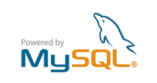

# UT4 UTILIZACIÓN DE TÉCNICAS DE ACCESO A DATOS

## Índice
  - [Acceso a bases de datos desde PHP](#acceso-a-bases-de-datos-desde-php)
  - [MySQL /MariaDB](#mysql-mariadb)
  - [MySQLi](#mysqli)
  - [PHP Data Objects(PDO)](#php-data-objectspdo)
    - [PDO: establecimiento de conexiones](#pdo-establecimiento-de-conexiones)
    - [PDO: ejecución de consultas](#pdo-ejecución-de-consultas)
    - [PDO: transacciones](#pdo-transacciones)
    - [PDO: obtención y utilización de conjuntos de resultados](#pdo-obtención-y-utilización-de-conjuntos-de-resultados)
    - [PDO: consultas preparadas](#pdo-consultas-preparadas)
  - [Errores y manejo de excepciones](#errores-y-manejo-de-excepciones)

## Acceso a bases de datos desde PHP

PHP soporta más de 15 **sistemas gestores de bases de datos**: SQLite, Oracle, SQL Server, PostgreSQL, IBM DB2, MySQL, etc
Hasta la versión 5 de PHP, el acceso a las bases de datos se hacía principalmente utilizando extensiones específicas para cada sistema gestor de base de datos (**extensiones nativas**).

A partir de la versión 5 de PHP se introdujo en el lenguaje una extensión para acceder de una forma común a distintos sistemas gestores: **PDO**.

La gran ventaja de PDO es que podemos seguir utilizando una misma sintaxis aunque cambiemos el motor de nuestra base de datos.

Mientras PDO ofrece un conjunto común de funciones, las extensiones nativas normalmente ofrecen más potencia (acceso a funciones específicas de cada gestor de base de datos) y en algunos casos también mayor velocidad.

## MySQL /MariaDB

**MySQL** es un sistema de gestión de bases de datos relacional desarrollado bajo **licencia dual**: Licencia pública general/Licencia comercial por Oracle Corporation y está considerada como la base de datos de código abierto más popular del mundo,​​ y una de las más populares en general junto a Oracle y Microsoft SQL Server.



**MariaDB** es un sistema de gestión de bases de datos derivado de MySQL con licencia GPL (General Public License). Es desarrollado por Michael (Monty) Widenius —fundador de MySQL—, la fundación MariaDB y la comunidad de desarrolladores de software libre.


Ambas bases de datos incorporan múltiples motores de almacenamiento siendo alguno de ellos:

**MyISAM** (**Aria** en MariaDB): motor que se utiliza por defecto. Muy rápido pero a cambio no contempla integridad referencial ni tablas transaccionales. 

**InnoDB** (**XtraDB** en MariaDB): es un poco más lento pero sí soporta tanto integridad referencial como tablas transaccionales.

## MySQLi

Esta extensión se desarrolló para aprovechar las ventajas que ofrecen las versiones 4.1.3 y posteriores de MySQL, y viene incluida con PHP a partir de la versión 5. 

Ofrece un interface de programación dual, pudiendo accederse utilizando objetos o funciones.
Por ejemplo, para establecer una conexión con un servidor MySQL y consultar su versión, podemos utilizar cualquiera de las siguientes formas:

- Utilizando objetos

```php
//utilizando constructores y métodos de la programación orientada a objetos
$conexion = new mysqli('localhost', 'usuario', 'contraseña', 'base_de_datos');
print $conexion‐>server_info;
```
- Utilizando funciones
  
```php 
// utilizando llamadas a funciones 
$conexion = mysqli_connect('localhost', 'usuario', 'contraseña', 'base_de_datos');
print mysqli_get_server_info($conexion);
```
## PHP Data Objects(PDO)

PDO se basa en las características de orientación a objetos de PHP pero, al contrario que la extensión MySQLi, no ofrece un interface de programación dual. 

Para acceder a las funcionalidades de la extensión hay que emplear los objetos que ofrece, con sus métodos y propiedades. No existen funciones alternativas.

### PDO: establecimiento de conexiones
Para establecer una conexión con una base de datos utilizando PDO hay que instanciar un objeto de la clase PDO pasándole los siguientes parámetros (solo el primero es obligatorio):

* Origen de datos (DSN). Es una cadena de texto que indica qué controlador se va a utilizar y a continuación, separadas por el carácter dos puntos, los parámetros específicos necesarios por el controlador, como por ejemplo el nombre o dirección IP del servidor y el nombre de la base de datos.
* Nombre de usuario con permisos para establecer la conexión.
* Contraseña del usuario.
* Opciones de conexión, almacenadas en forma de array.

```php 
$dwes = new PDO('mysql:host=localhost;dbname=dwes', 'dwes', 'abc123.');
```

Si se utiliza **el controlador para MySQL**, los parámetros específicos para utilizar en la cadena DSN (separadas unas de otras por el carácter punto y coma) a continuación del prefijo mysql: son los siguientes:
- **host**: nombre o dirección IP del servidor.
- **port**: número de puerto TCP en el que escucha el servidor.
- **dbname**: nombre de la base de datos.
- **unix_socket**: socket de MySQL en sistemas Unix.

Para indicar que utilice codificación UTF-8 para los datos que se transmitan:

```php 
$opciones = array(PDO::MYSQL_ATTR_INIT_COMMAND => "SET NAMES utf8"); 
$dwes = new PDO('mysql:host=localhost;dbname=dwes', 'dwes', 'abc123.', $opciones);
```
:computer: Hoja04_BBDD_01 (Ej 1,2,3)

### PDO: ejecución de consultas
Hay que diferenciar entre las sentencias SQL que no devuelven datos, de aquellas que sí lo devuelven.

En el caso de las consultas de acción, como INSERT, DELETE o UPDATE, el **método exec** devuelve el número de registros afectados.

```php 
$registros=$dwes->exec('DELETE FROM stock WHERE unidades=0');
echo "<p>Se han borrado $registros registros.</p>";
```
Si la consulta genera un conjunto de datos (SELECT) hay que utilizar el **método query**, que devuelve un objeto de la clase **PDOStatement**.

```php 
$dwes = new PDO("mysql:host=localhost;dbname=dwes", "dwes", "abc123."); 
$resultado = $dwes‐>query("SELECT producto, unidades FROM stock"); 
```
### PDO: transacciones

Por defecto PDO trabaja en modo "autocommit", es decir, que confirma de forma automática cada sentencia que ejecuta el servidor. Para trabajar con transacciones, PDO incorpora tres métodos:
- **beginTransaction**: deshabilita el modo "autocommit" y comienza una nueva transacción, que finalizará cuando se ejecute uno de los dos métodos siguientes.
- **commit**: confirma la transacción actual.
- **rollback**: revierte los cambios llevados a cabo en la transacción actual.
Una vez ejecutado un commit o un rollback, se volverá al modo de confirmación automática.

```php 
$ok = true; 
$dwes->beginTransaction(); 
if($dwes->exec('DELETE …') == 0)  $ok = false; 
if($dwes->exec('UPDATE …') == 0)  $ok = false; 
… 
if ($ok) $dwes->commit();  // Si todo fue bien confirma los cambios 
else $dwes->rollback(); // y si no, los revierte
```
### PDO: obtención y utilización de conjuntos de resultados

Al igual que en MySQLi, en PDO hay varias posibilidades para tratar con el conjunto de resultados devueltos por el método query. La más utilizada es el **método fetch**:

```php 
$resultado = $dwes->query('SELECT campo1, campo2 FROM tabla WHERE condicion');
while ($registro = $resultado->fetch()) 
{
echo $registro['campo1'].": ".$registro['campo2']."<br />";
} 
```
Por defecto, el **método fetch** genera y devuelve, a partir de cada registro, un array con claves numéricas y asociativas. Para cambiar su comportamiento, admite un parámetro opcional que puede tomar uno de los siguientes valores:
- **PDO::FETCH_ASSOC**: devuelve solo un array asociativo.
- **PDO::FETCH_NUM**: devuelve solo un array con claves numéricas.
- **PDO::FETCH_BOTH**: devuelve un array con claves numéricas y asociativas. Es el comportamiento por defecto.
- **PDO::FETCH_OBJ**: devuelve un objeto cuyas propiedades se corresponden con los campos del registro.

```php 
$resultado = $dwes->query('SELECT campo1, campo2 FROM tabla WHERE condicion');
while ($registro = $resultado->fetch(PDO::FETCH_OBJ)) 
{
	echo $registro->campo1.": ".$registro->campo2."<br />";
} 
```
- **PDO::FETCH_LAZY**: devuelve tanto el objeto como el array con clave dual anterior.
- **PDO::FETCH_BOUND**: devuelve true y asigna los valores del registro a variables, según se indique con el método bindColumn. Este método debe ser llamado una vez por cada columna, indicando en cada llamada el número de columna (empezando en 1) y la variable a asignar.

```php
$resultado = $dwes->query('SELECT campo1, campo2 FROM tabla WHERE condicion');
$resultado->bindColumn(1, $campo1);
$resultado->bindColumn(2, $campo2);
while ($registro = $resultado->fetch(PDO::FETCH_BOUND)) 
{
	echo $campo1.": ".$campo2."<br />";
} 
```
:computer: Hoja04_BBDD_01(Ej 4,5,6 y 7)

### PDO: consultas preparadas

Para preparar la consulta se utiliza el **método prepare** de la clase PDO. Este método devuelve un objeto de la clase **PDOStatement**. Los parámetros se pueden marcar utilizando signos de interrogación como en MySQLi.

```php
$consulta=$dwes->prepare('INSERT INTO tabla (campo1, campo2) VALUES (?, ?)');
```
O también se pueden utilizar parámetros con nombre, precediéndolos por el símbolo de dos puntos:

```php
$consulta=$dwes->prepare('INSERT INTO tabla (campo1, campo2) VALUES (:cm1, :cm2)’);
```
Si se utiliza parámetros con nombre hay que indicar ese nombre en la llamada a **bindParam**

```php
$campo1 = "valor_campo1";
$campo2 = "valor_campo2";
$consulta->bindParam(1, $campo1); //o $consulta->bindParam(:cm1, $campo1);
$consulta->bindParam(2, $campo2); //o $consulta->bindParam(:cm2, $campo2);
```
Una vez preparada la consulta y enlazados los parámetros con sus valores, se ejecuta la consulta utilizando el **método execute**.

```php
$consulta->execute();
```
:computer: Hoja04_BBDD_01(Ej 8)

## Errores y manejo de excepciones

PHP define una **clasificación de los errores** que se pueden producir en la ejecución de un programa y ofrece métodos para ajustar el tratamiento de los mismos. Para hacer referencia a cada uno de los niveles de error, PHP define una serie de **constantes**. 

Cada nivel se identifica por una constante. Por ejemplo, la constante E_NOTICE hace referencia a avisos que pueden indicar un error al ejecutar el script, y la constante E_ERROR engloba errores fatales que provocan que se interrumpa forzosamente la ejecución.

La configuración inicial de cómo se va a tratar cada error según su nivel se realiza en php.ini el fichero de configuración de PHP. 

Entre los principales parámetros que puedes ajustar están:
- **error_reporting**: indica qué tipos de errores se notificarán. Su valor se forma utilizando los operadores a nivel de bit para combinar las constantes anteriores. Su valor predeterminado es E_ALL & ~E_NOTICE que indica que se notifiquen todos los errores (E_ALL) salvo los avisos en tiempo de ejecución (E_NOTICE).
- **display_errors**: en su valor por defecto (On), hace que los mensajes se envíen a la salida estándar (y por lo tanto se muestren en el navegador). Se debe desactivar (Off) en los servidores que no se usan para desarrollo sino para producción.

Desde código se puede usar la función **error_reporting** con las constantes anteriores para establecer el nivel de notificación en un momento determinado.

A partir de la versión 5 se introdujo en PHP un modelo de excepciones similar al existente en otros lenguajes de programación: 

- El código susceptible de producir algún error se introduce en un bloque **try**.
- Cuando se produce algún error, se lanza una excepción utilizando la instrucción **throw**.
- Después del bloque try debe haber como mínimo un bloque **catch** encargado de procesar el error.
- Si una vez acabado el bloque try no se ha lanzado ninguna excepción, se continúa con la ejecución en la línea siguiente al bloque o bloques catch.

Por ejemplo, para lanzar una excepción cuando se produce una división por cero podrías hacer: 

```php
try { 
	if ($divisor == 0) 
		throw new Exception("División por cero."); 
	$resultado = $dividendo / $divisor; 
} 
catch (Exception $e) { 
	echo "Se ha producido el siguiente error: ".$e->getMessage(); 
}

```
La clase PDO permite definir la fórmula que usará cuando se produzca un error, utilizando el atributo PDO::ATTR_ERRMODE. Las posibilidades son:

- **PDO::ERRMODE_SILENT**: no se hace nada cuando ocurre un error. Es el comportamiento por defecto.
- **PDO::ERRMODE_WARNING**: genera un error de tipo E_WARNING cuando se produce un error.
- **PDO::ERRMODE_EXCEPTION**: cuando se produce un error lanza una excepción utilizando el manejador propio**PDOException**.

Es decir, que si quieres utilizar excepciones con la extensión PDO, debes configurar la conexión haciendo:

```php
$dwes->setAttribute(PDO::ATTR_ERRMODE, PDO::ERRMODE_EXCEPTION); 
```
Por ejemplo, el siguiente código captura la excepción que lanza PDO debido a que la tabla no existe: 

```php
$dwes = new PDO("mysql:host=localhost; dbname=dwes", "dwes", "abc123."); 
$dwes->setAttribute(PDO::ATTR_ERRMODE, PDO::ERRMODE_EXCEPTION); 
try { 
	$sql = "SELECT * FROM tablaincorrecta"; 
	$result = $dwes->query($sql); 
	… 
} 
catch (PDOException $p) { 
	echo "Error ".$p->getMessage()."<br />"; 
}
```


