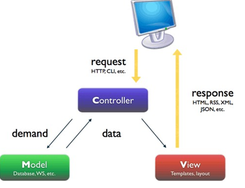
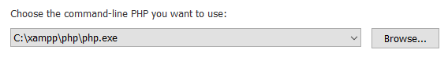
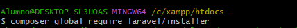
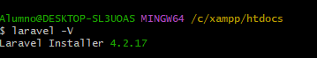
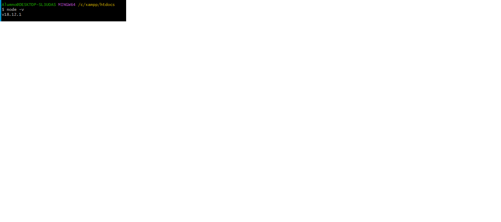
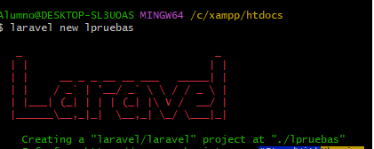
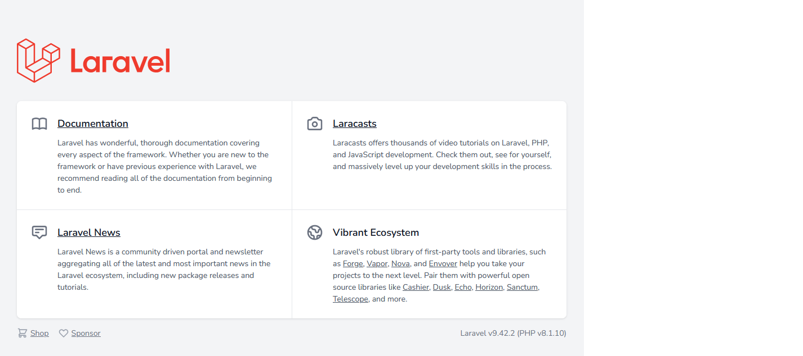
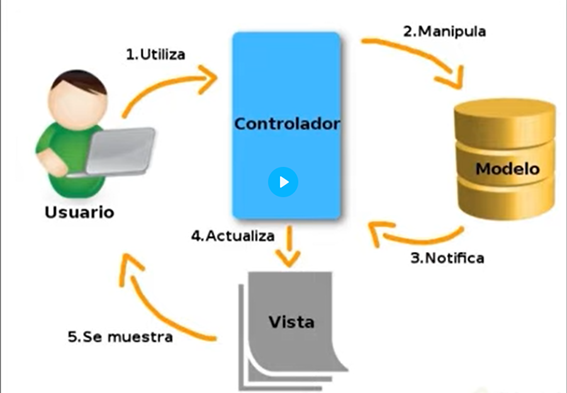
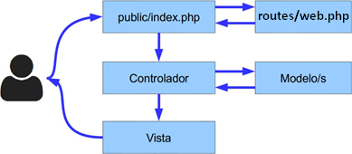
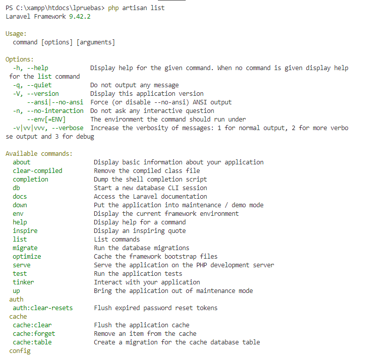

# UT6 GENERACIÓN DINÁMICA DE PÁGINAS WEB 

## Índice

- [UT6 GENERACIÓN DINÁMICA DE PÁGINAS WEB](#ut6-generación-dinámica-de-páginas-web)
  - [Índice](#índice)
  - [Patrón arquitectónico MVC (Modelo-Vista-Controlador)](#patrón-arquitectónico-mvc-modelo-vista-controlador)
    - [Funcionamiento MVC](#funcionamiento-mvc)
  - [Laravel](#laravel)
    - [Instalación](#instalación)
    - [Patrón de Laravel](#patrón-de-laravel)
    - [Estructura de Laravel](#estructura-de-laravel)
    - [Funcionamiento básico](#funcionamiento-básico)
    - [Artisan](#artisan)
    - [Rutas](#rutas)
    - [Controladores](#controladores)
      - [Crear un nuevo controlador](#crear-un-nuevo-controlador)
      - [Generar una URL a una acción](#generar-una-url-a-una-acción)
    - [Vistas](#vistas)
      - [pasar variables a las vistas](#pasar-variables-a-las-vistas)
      - [Organización de las vistas](#organización-de-las-vistas)
    - [Motor de plantillas Blade](#motor-de-plantillas-blade)
      - [Mostrar un dato solo si existe](#mostrar-un-dato-solo-si-existe)
      - [Comentarios](#comentarios)
      - [Estructuras de control](#estructuras-de-control)
      - [Enlaces a otras rutas con Blade](#enlaces-a-otras-rutas-con-blade)
      - [Definir Plantillas con Blade](#definir-plantillas-con-blade)
    - [Redirecciones](#redirecciones)
      - [Redirecciones con valores](#redirecciones-con-valores)
      - [Redirección con los valores de la petición](#redirección-con-los-valores-de-la-petición)
    - [Formularios](#formularios)
      - [Protección contra CSRF](#protección-contra-csrf)
      - [Validación de formularios](#validación-de-formularios)
      - [Form Request para validaciones más complejas](#form-request-para-validaciones-más-complejas)
    - [Base de datos](#base-de-datos)
      - [Configuración](#configuración)
      - [Migraciones: Schema Builder](#migraciones-schema-builder)
        - [Estructura de una migración](#estructura-de-una-migración)
        - [Crear y borrar una tabla](#crear-y-borrar-una-tabla)
        - [Añadir columnas](#añadir-columnas)
        - [Añadir índices](#añadir-índices)
        - [Claves ajenas](#claves-ajenas)
        - [Ejecutar migraciones](#ejecutar-migraciones)
      - [Modelos de datos mediante ORM](#modelos-de-datos-mediante-orm)
        - [Definición de un modelo](#definición-de-un-modelo)
        - [Nombre del modelo](#nombre-del-modelo)
        - [Clave primaria](#clave-primaria)
        - [Timestamps](#timestamps)
        - [Uso de un modelo de datos](#uso-de-un-modelo-de-datos)
        - [Consultar datos](#consultar-datos)
        - [Insertar datos](#insertar-datos)
        - [Actualizar datos](#actualizar-datos)
        - [Borrar datos](#borrar-datos)
      - [Seeders](#seeders)
      - [Factories](#factories)
    - [Datos de entrada](#datos-de-entrada)
    - [Ficheros de entrada](#ficheros-de-entrada)
    - [Control de usuarios : Laravel Jetstream](#control-de-usuarios--laravel-jetstream)
      - [Rutas](#rutas-1)
      - [Vistas](#vistas-1)
      - [Autenticación de un usuario](#autenticación-de-un-usuario)
      - [Configuraciones](#configuraciones)
      - [Registro de un usuario](#registro-de-un-usuario)
      - [Registro manual de un usuario](#registro-manual-de-un-usuario)
      - [Acceder a los datos del usuario autenticado](#acceder-a-los-datos-del-usuario-autenticado)
      - [Cerrar la sesión](#cerrar-la-sesión)
      - [Comprobar si un usuario está autenticado](#comprobar-si-un-usuario-está-autenticado)
    - [Middleware o filtros](#middleware-o-filtros)
      - [Definir un nuevo Middleware](#definir-un-nuevo-middleware)
      - [Middleware global](#middleware-global)
      - [Middleware asociado a rutas](#middleware-asociado-a-rutas)
        - [Proteger rutas](#proteger-rutas)


<div class="page"/>

## Patrón arquitectónico MVC (Modelo-Vista-Controlador)

En muchas ocasiones se mezcla el código propio de la lógica de la aplicación, con el código necesario para crear el interface web que se presenta a los usuarios.

Existen varios métodos que permiten separar la lógica de presentación (en nuestro caso, la que
genera las etiquetas HTML) de la lógica de negocio, donde se implementa la lógica propia de
cada aplicación.

El más extendido es el patrón de diseño Modelo – Vista – Controlador (MVC). Este patrón pretende dividir el código en tres partes, dedicando cada una, a una función definida y diferenciada de las otras:

* __Modelo__: es el encargado de manejar los datos propios de la aplicación.Debe proveer mecanismos para obtener y modificar la información del mismo. Si la aplicación utiliza algún tipo de almacenamiento para su información (como un SGBD), tendrá que encargarse de almacenarla y recuperarla.

* __Vista__: es la parte del modelo que se encarga de la interacción con el usuario. En esta parte se encuentra el código necesario para generar el interface de usuario (en nuestro caso en HTML), según la información obtenida del modelo.

* __Controlador__: en este módulo se decide qué se ha de hacer, en función de las acciones del usuario con su interface. Con esta información,interactúa con el modelo para indicarle las acciones a realizar y, según el resultado obtenido, envía a la vista las instrucciones necesarias para generar el nuevo interface.

### Funcionamiento MVC

1. El usuario envía petición al controlador vía una URL
2. El controlador solicita al modelo los datos
3. El modelo devuelve los datos
4. El controlador selecciona una vista
5. Se devuelve la vista seleccionada al controlador
6. El controlador devuelve una vista (página php) que carga los datos del modelo seleccionado



Aunque se puede programar utilizando MVC por tu cuenta, es más habitual utilizar el patrón MVC en  conjunción con un framework o marco de desarrollo. Existen numerosos frameworks disponibles en PHP,  muchos de los cuales incluyen soporte para MVC.

__La arquitectura MVC__ separa __la lógica de negocio__ (el modelo) y __la  presentación__ (la vista) por lo que se consigue un mantenimiento  más sencillo de las aplicaciones.

Si por ejemplo una misma aplicación debe ejecutarse tanto en un  navegador estándar como un navegador de un dispositivo móvil,  solamente es necesario crear una vista nueva para cada  dispositivo; manteniendo el controlador y el modelo original. 

__El  controlador se encarga de aislar al modelo y a la vista de los  detalles del protocolo__ utilizado para las peticiones (HTTP, consola  de comandos, email, etc.). __El modelo se encarga de la abstracción  de la lógica relacionada con los datos__, haciendo que la vista y las  acciones sean independientes de, por ejemplo, el tipo de gestor de  bases de datos utilizado por la aplicación.

Para poder entender las ventajas de utilizar el patrón MVC, se va a  transformar una aplicación simple realizada con PHP en una  aplicación que sigue la arquitectura MVC.

:computer: Hoja06_MVC_01

## Laravel

Laravel es un framework de código abierto para el  desarrollo de aplicaciones web en PHP que posee una  sintaxis simple y elegante.

Características:
* Creado en 2011 por Taylor Otwell.
* Está	inspirado	en	__Ruby	on	rails__	y	__Symfony__,	de	quien	posee  muchas dependencias.
* Está diseñado para desarrollar bajo el patrón __MVC__
* Posee	un	sistema	de	mapeado	de	datos	relacional	llamado __Eloquent ORM__.
* Utiliza un sistema de procesamiento de plantillas llamado __Blade__,  el cuál hace uso de la caché para darle mayor velocidad

### Instalación

Para la utilización de Laravel en primer lugar necesitamos tener instalado
lo siguiente:

* Un servidor web Apache
* PHP
* MySQL
* Composer [Enlace a la página oficial](https://getcomposer.org)
    * Permite descargar y gestionar las dependencias del Framework.
    * Es un administrador de dependencias para PHP que nos permite descargar paquetes  desde un repositorio para agregarlo a nuestro proyecto.
    * Por defecto, se agregan a una carpeta llamada /vendor. De esta manera evitamos  hacer las búsquedas manualmente y el mismo Composer se puede encargar de  actualizar las dependencias que hayamos descargado por una nueva versión.
  * al instalar composer indicar la dirección del php ejemplo en windows
  

  
* La librería de laravel
  * Usando la terminal de GitBash vamos a la carpeta de publicación c:/xampp/htdocs y escribimos:
    * composer global require laravel /installer
  


Instala la última versión de Laravel;con el paso del tiempo conviene ir actualizando la version de Laravel con el comando: composer global update laravel/installer

* comprobamos la versión del instalador de lavarel


      
* Adicionalmente también es recomendable instalar Node.js. Se instala la herramienta NPM (Node Package Manager), herramienta que permite instalar librerías de JavaScript, como BootStrap o jQuery. [La página oficial de Node.js](https://nodejs.org/es/download).
    * comprobamos la versión de node.js instalada



Ahora podemos comprobar que todo lo instalado es correcto y que podemos crear nuestro primer proyecto de prueba en Laravel (lpruebas), aunque anteriormente ya estabamos posicionados en la carpeta de publicación del XAMPP hasta ahora no era necesario pero ahora sí.

* laravel new lpruebas



También tenemos la opción de solo realizar en un paso la instalación de Laravel y la creación del proyecto, poniendo en la carpeta de publicación: 

* composer create-project laravel/laravel lpruebas

Entramos en la carpeta __public__  y comprobamos que se ha instalado correctamente



Como entorno de desarrollo vamos a utilizar Visual Studio code e instalar la extensión Laravel extension pack que a su vez nos instala 12 plugins.

### Patrón de Laravel

Laravel se basa en un diseño  MVC



:computer: Hoja06_MVC_02 (ejercicio 1)

### Estructura de Laravel

Vamos a ver la estructura de nuestro proyecto, para así entender que hay dentro de las principales carpetas:
* __app__ - contiene los controladores, modelos, vistas y  configuraciones de la aplicación. En esta carpeta escribiremos la  mayoría del código para que nuestra aplicación funcione. En la  carpeta Models tenemos un solo modelo: “User.php” que se crea  por defecto.
* __app/Http__
  * __Controllers__ son los que interaccionan con los modelos
  * __Midleware__ son filtros de seguridad cuando se envía una ruta, un formulario….
* __bootstrap__ son archivos del sistema. En esta carpeta se incluye el código que se carga para procesar cada una de las llamadas a nuestro proyecto. Normalmente, no tendremos que modificar nada de esta carpeta.
* __config__ todos los archivos de configuración del sistema
  * __app.php__ tenemos los namespace para acceder a las librerías internas de Laravel,si descargamos algo nuevo para nuestra aplicación hay que  instalar los namespace aquí
  * __database.php__ se configura la B.D. que ya contiene mysql, pero también  tiene sqlite y otras
  * __filesystems.php__ maneja discos internos en laravel: imágenes, videos,…
* __database__
  * __migrations__ se crea la estructura para la BD,tablas...
* __lang__ en esta carpeta se guardan archivos PHP que contienen arrays con los textos de nuestro sitio web en diferentes lenguajes; solo será necesario utilizarlo en caso de que se desee que la aplicación se pueda traducir
* __public__ es la única carpeta a la que los usuarios de la  aplicación pueden acceder. Todas las peticiones y solicitudes a la aplicación pasan por esta carpeta, ya que en ella se encuentra el index.php, este archivo es el que inicia todo el  proceso de ejecución del framework. En este directorio también se alojan los archivos CSS, Javascript, imágenes y  otros archivos que se quieran hacer públicos.
* __resources__
  * __views__ las vistas. Welcome.blade.php que es la página de inicio
* __routes__ las rutas. web.php es la más importante, aquí se definen las rutas para interpretar las solicitudes que el usuario hace al sistema
* __storage__ discos internos de laravel. En esta carpeta almacena toda la información interna necesaria para la ejecución de la web, como los archivos de sesión, la caché, la compilación de las vistas, metainformación y logs del sistema.
* __tests__ esta carpeta se utiliza para los ficheros con las pruebas automatizadas. Laravel incluye un sistema que facilita todo el proceso de pruebas con PHPUnit.
* __vendor__ En esta carpeta se alojan todas las librerías que  conforman el framework y sus dependencias
  
Además, en la carpeta raíz también encontramos tres ficheros importantes que utilizaremos:
* __.env__ se utiliza para almacenar los valores de configuración que son propios de la máquina o instalación actual, lo que nos permite cambiar fácilmente la configuración según la máquina en la que se instale y tener opciones distintas para producción, para distintos desarrolladores.
* __composer.json__ este fichero es el utilizado por Composer para realizar la instalación de Laravel. En una instalación inicial únicamente se especificará la instalación de un paquete (el propio framework de laravel), pero podemos especificar la instalación de otras librerías o paquetes externos que añadan funcionalidad a Laravel.
* __package.json__ en este fichero se encuentran algunas dependencias por parte cliente( Bootstrap o jQuery), y se encuentran preinstaladas en la carpeta node_modules.
Estos tres archivos no deben subirse a ningun repositorio(GitHub) incluir en el __.gitignore__, porque si importamos un proyecto en laravel, podemos regenerar las dependencias de PHP con __composer install__ y las dependencias de JavaScript con __npm install__, es decir, los archivos composer.json y package.json actúan como indice de dependencias de PHP y JavaScript, respectivamente.

### Funcionamiento básico

El funcionamiento básico que sigue Laravel tras una petición web a una URL de nuestro sitio es el siguiente:
1. Todas las peticiones entran a través del fichero public/index.php, el cual en primer lugar comprobará en el fichero de rutas (routes/web.php) si la URL es válida y en caso  de serlo a qué controlador tiene que hacer la petición.
2. A continuación se llamará al método del controlador asignado para dicha ruta. Como hemos visto, el controlador es el punto de entrada de las peticiones del usuario.
3. Accederá a la base de datos (si fuese necesario) a través de los "modelos" para obtener datos (o para añadir, modificar o eliminar).
4. Tras obtener los datos necesarios los preparará para pasárselos a la vista.
5. Por último se mostrará al usuario
   
   

### Artisan

Laravel incluye un interfaz de línea de comandos (CLI,  Command line interface llamado __Artisan__.

Esta utilidad nos va a permitir realizar múltiples tareas necesarias durante el  proceso de desarrollo o despliegue a producción de una aplicación, por lo que nos facilitará y acelerará el trabajo.

Para ver una lista de todas las opciones que incluye Artisan podemos ejecutar el siguiente  comando en una consola o terminal del sistema en la carpeta raíz de nuestro proyecto:
__php artisan list__ (o php artisan)

vamos a la terminal de Visual Studio Code y ejecutamos



Para ver un listado con todas las rutas que hemos definido en el fichero routes\web.php  podemos ejecutar el comando:

__php artisan route:list__

Esto nos mostrará una tabla con el método, la dirección, la acción y los filtros definidos  para todas las rutas.

A través de la __opción make__ podemos generar diferentes componentes de Laravel (controladores, modelos, filtros, etc.) como si fueran plantillas, esto nos ahorrará  mucho trabajo y podremos empezar a escribir directamente el contenido del  componente.Por ejemplo, para crear un nuevo controlador tendríamos que escribir:

__php artisan make:controller TaskController__

Dentro de Laravel, ya tenemos un servidor interno que haría la función de servidor web: 

__php artisan serve__

Esto pondrá en marcha un servidor en el puerto 8000; podremos acceder anuestro proyecto a través de la URL http://localhost:8000

### Rutas

Las rutas se tienen que definir en el fichero __routes/web.php__.

Cualquier ruta no definida en este fichero no será válida, generado una excepción (lo que devolverá un error 404).

Las rutas, en su forma más sencilla, pueden devolver __directamente un valor__  desde el propio fichero de rutas, pero también podrán __generar la llamada  a una vista o a un controlador__.

Con las rutas, construimos las URL amigables( son fáciles de recordar y más seguras) de nuestra aplicación, es importante para el posicionamiento web. 

Son un mecamismo que nos permite establecer el controlador al que debemos enviar la petición de una determinada URL. 

Además de definir la URL de la petición, también indican el método con el cual se ha de hacer dicha petición. Los dos métodos más utilizados son GET y tipo POST.

En el archivo __routes/web.php__ inicialmente ya existe una ruta predefinida a la raiz del proyecto
```php
Route::get('/', function () {
    return view('welcome');
});
```
Lo que hace dicha ruta es llamar al método __view__, que carga una vista o archivo final HTML situado en __resources/views/welcome.blade.php__ 

para definir una ruta, realizamos la llamada al método get/post de la clase Route

```php
Route::get('/',function(){
  return 'Hola mundo';
});
```
Este código se lanzaría cuando se realice una petición tipo GET a la ruta raíz  de nuestra aplicación.

Para definir una ruta tipo POST se realizaría de la misma forma pero cambiando el verbo  GET por POST:
```php
Route::post('foo/bar',function(){
  return 'Hola mundo';
});
```
<div class="page"/>

En este caso la ruta apuntaría a la dirección URL foo/bar
Si queremos que una ruta se defina a la vez para get y post lo podemos hacer añadiendo un  array con los tipos, de la siguiente forma:
```php
Route::match(array('GET','POST'),'/',function(){
  return 'Hola mundo';
});
```
O para cualquier tipo de petición HTTP utilizando el método any
```php
Route::any('/',function(){
  return 'Hola mundo';
});
```
Si queremos añadir parámetros a una ruta simplemente los tenemos que indicar
entre llaves {} a continuación de la ruta, de la forma:
```php
Route::get('user/{id}',function($id){
  return 'User'.$id;
});
```
Definimos la ruta /user/{id}, donde id es __obligatorio__ y puede ser cualquier valor.
En caso de no especificar ningún id se produciría un error. También podemos indicar  que un parámetro es opcional simplemente añadiendo el símbolo ? al final (y en  este caso no daría error si no se realiza la petición con dicho parámetro):
```php
Route::get('user/{name?}',function($name=null){
  return $name;
});
//tambien podemos poner algún valor por defecto
Route::get('user/{name?}',function($name='cic'){
  return $name;
});
```
Podemos definir rutas con alias o named routes, al definir la ruta, asociamos al método name el nombre que queramos. Esto es interesante cuando esta ruta forma parte de algún enlace en alguna página de nuestra aplicación
```php
Route::get('clientes',function(){return "listado";})->name('ruta_clientes');
```
Laravel también permite el uso de expresiones  regulares para validar los  parámetros que se le pasan a una ruta. Por ejemplo, para validar que un  parámetro esté formado sólo por letras o sólo por números:
```php
Route::get('user/{name?}',function($name){return $name;})->where('name','[A-Za-z]+');
```
:computer: Hoja06_MVC_02 (ejercicio 2)

### Controladores

__Un controlador es el componente que__ nos permite agrupar, de una mejor manera, el código necesario para dar respuesta a una petición HTTP; es el intermediario entre la vista y el modelo y __se encarga de definir la lógica de negocio__ y los controladores son necesarios para resolver las solicitudes que llegan.

Lo recomendable es asociar las rutas a un método de un controlador.

Esto nos permitirá separar mucho mejor el código y crear clases  (controladores) que agrupen toda la funcionalidad de un determinado  recurso.

>Por ejemplo, podemos crear un controlador para gestionar toda la lógica  asociada al control de usuarios o cualquier otro tipo de recurso.

Los controladores son el punto de entrada de las peticiones de los usuarios  y son los que deben contener toda la lógica asociada al procesamiento de  una petición, encargándose de realizar las consultas necesarias a la base  de datos, de preparar los datos y de llamar a la vista correspondiente con  dichos datos.

Los controladores se almacenan en  ficheros PHP en la carpeta __App/Http/Controllers__ y normalmente se les añade el sufijo __Controller__.
Ejemplo HomeController.php 
```php
<?php
namespace App\Http\Controllers;

use Illuminate\Http\Request;

class HomeController extends Controller
{
    public function __invoke(){
       return view('home');
    }
}
```
Todos los controladores tienen que extender la clase base Controller que se
encuentra en la carpeta App/Http/Controllers.

Se utiliza para centralizar toda la lógica que se vaya a utilizar de forma compartida por los controladores de nuestra aplicación.

Una vez definido un controlador ya podemos asociarlo a una ruta. Para  esto tenemos que modificar el fichero de rutas web.php de la forma:

Route::get('/',HomeController::class) -> name('home');

#### Crear un nuevo controlador
Para crear uno nuevo bien lo podemos hacer a mano y rellenar  nosotros todo el código, o podemos utilizar el siguiente comando de  Artisan que nos adelantará todo el trabajo:

__php artisan make:controller EjemploController__

el comando artisan admite algunos parámetros adicionales más. Uno muy útil es el __paramétro -i__ que crea el controlador con un método llamado __invoke__, que se autoejecuta cuando es llamado desde algún proceso de enrutamiento. Dentro del método invoke, podemos definir la lógica de generar y obtener los datos que necesita una vista y renderizarla,  como es el ejemplo visto.

si creamos un controlador con __la opción -r__ en vez de -i, __creará un controlador de recursos(resources)__ y predefine en él una serie de métodos de utilidad vacios para cada una de las operaciones principales que se pueden realizar sobre una entidad de nuestra aplicación:
* __index__- muestra un listado de los elementos de esa entidad o recurso.
* __create__ muestra el formulario para dar de alta nuevos elementos.
* __store__ almacena en la base de datos el recurso creado con el formulario anterior.
* __show__ muestra los datos de un recurso específico ( a partir de su clave o id).
* __edit__ muestra el formulario para editar un recurso existente.
* __update__ actrualiza en la base de datos el recurso editado en el formulario anterior.
* __destroy__ elimina un recurso por su identificador.

También podemos crear subcarpetas dentro de la carpeta Controllers para  organizarnos mejor. Pero a la hora de hacer referencia al controlador únicamente  se tendrá que hacer a través de su espacio de nombres.
Por ejemplo para crear un controlador en app\Http\Controllers\Fotos\AdminController:
__php artisan make:controller Fotos/AdminController__

#### Generar una URL a una acción
en el fichero de rutas se debe añadir un __name__ a la ruta:
```php
Route::get(‘foo’, [FooController::class,’method'])->name(“foo.method");
```
Luego dede una plantilla podríamos hacer
```html
<a href="{{ route(‘foo.method') }}">¡Aprieta aquí!</a>
```
:computer: Hoja06_MVC_03

<div class="page"/>

### Vistas
Las vistas son la forma de presentar el resultado (una pantalla de nuestro sitio web) de forma  visual al usuario, el cual podrá interactuar con él y volver a realizar una petición.

Las vistas además nos permiten separar toda la parte de presentación de resultados de la  lógica (controladores) y de la base de datos (modelos). Por lo tanto __no tendrán que realizar  ningún tipo de consulta ni procesamiento de datos__, simplemente  recibirán datos y los  prepararán para mostrarlos como HTML.

Las vistas se almacenan en la carpeta __resources/views__ como ficheros __PHP__. Contendrán el  código HTML de nuestro sitio web, mezclado con los assets (CSS, imágenes, Javascripts, etc.  que estarán almacenados en la carpeta public) y algo de código PHP (o código Blade de  plantillas) para presentar los datos de entrada como un resultado HTML.

#### pasar variables a las vistas
Una vez tenemos una vista tenmos que asociarla a una ruta para poder mostrarla.

Se suele pasar información como variables desde las rutas o los controladores a las vistas. Por ejemplo, pasar listado de datos.

En este ejemplo estamos pasando la variable nombre y apellidos a la vista __inicio__, con el método __with__:

```php
Route::get('/',function(){
  $nombre="pepe";
  $apellidos="Grillo";
  return view('inicio')->with(['nombre'=>$nombre,'apellidos'=>$apellidos]);
});
```
Otra alternativa es pasarlo como segundo parámetro a la función __view__ como array asociativo

```php
return view('inicio',['nombre'=>$nombre,'apellidos'=>$apellidos]);
```
Otra mucho más usada es con la funcion __compact__ como segundo parámetro de __view__. En este caso, solo le pasamos el nombre de la variable definida en nuestro código cuyo valor queremos pasar a la vista.

```php
return view('inicio',compact('nombre','apellidos'));
```
En este ejemplo estamos pasando las variables nombre y apellidos a la vista inicio, de forma que podemos acceder a ellas como si de una variable local se tratara.

```php
<p> bienvenido a <?php echo $nombre.",".$apellidos ?></p>
```

lo habitual es acceder a la variable mediante la sintaxis específica de Blade, el motor de plantillas de Laravel que veremos.

```php
<p> bienvenido a {{$nombre}}.",".{{$apellidos}}</p>
```
#### Organización de las vistas
Las vistas se pueden organizar en sub-carpetas dentro de la carpeta resources/views.

Por ejemplo podríamos tener una carpeta resources/views/user y dentro de esta todas las
vistas relacionadas, como por ejemplo login.php, register.php o profile.php.

En este caso para referenciar las vistas que están dentro de sub-carpetas tenemos que utilizar  la notación tipo "dot", en la que las barras que separan las carpetas se sustituyen por puntos.

Por ejemplo, para referenciar la vista resources/views/user/login.php usaríamos el nombre  user.login, o la vista resources/views/user/register.php la cargaríamos de la forma:

```php
Route::get('register',function(){
  return view('user.register');
});
```
:computer: Hoja06_MVC_04

### Motor de plantillas Blade

Laravel utiliza Blade para la definición de plantillas en las vistas.

Esta librería permite realizar todo tipo de operaciones con los datos, además de la  sustitución de secciones de las plantillas por otro contenido, herencia entre plantillas,  definición de layouts o plantillas base, etc.

Los ficheros de vistas que utilizan el sistema de plantillas Blade tienen que tener la  extensión __.blade.php.__

Esta extensión tampoco se tendrá que incluir a la hora de referenciar una vista  desde el fichero de rutas o desde un controlador. Es decir, utilizaremos view('home')  tanto si el fichero se llama home.php como home.blade.php.

En general __el código__ que incluye __Blade en una vista__ empezará por __los símbolos @__  o __{{__, el cual posteriormente será procesado y preparado para mostrarse por  pantalla.

Blade no añade sobrecarga de procesamiento,  ya que todas las vistas son
preprocesadas y cacheadas.

El método más básico que tenemos en Blade es el de mostrar datos. Para esto  utilizaremos las llaves dobles {{ }} y dentro de ellas escribiremos la variable o  función a mostrar:

Ejemplo:
```php 
Hola {{$name}}
La hora actual es {{time()}}
```
#### Mostrar un dato solo si existe

Para	comprobar	que	una	variable	existe	o	tiene	un	determinado  valor podemos utilizar el operador ternario de la forma:
``` 
  {{ isset($name) ? $name : 'Valor por defecto' }}
```
O simplemente usar la notación que incluye Blade para este fin:
``` 
  {{ $name or 'Valor por defecto' }}
```
#### Comentarios
Para escribir comentarios en Blade se utilizan los símbolos {{-- y --}}:
``` 
  {{-- Este comentario no se mostrará en HTML --}}
```

#### Estructuras de control

Todas las directivas Blade vienen precedidas del __símbolo @__ nos permite utilizar la __estructura condicional if__ de las siguientes formas:

```php 
@if( count($users) === 1 )  
  ¡Solo hay un usuario!  
@elseif (count($users) > 1)  
  ¡Hay muchos usuarios!
@else
  ¡No hay ningún usuario!  
@endif
```
<div class="page"/>

__Estructuras repetitivas bucles tipo for, while o foreach__
```php
@for ($i = 0; $i < 10; $i++)  
  El valor actual es {{ $i }}
@endfor
@while (true)
<p>Soy un bucle while infinito!</p>  
@endwhile
@foreach ($users as $user)
<p>Usuario {{ $user->name }} con identificador: {{ $user->id }}</p>  
@endforeach
```
__Estructura alternativa que controla a la vez que la variable esté definida y tenga elementos forelse__
Esta directiva permite una cláusula adicional @empty para indicar qué hacer si la colección no tiene elementos o está sin definir.
```php
@forelse ($elementos as $elemento)
<li> {{$elemento}}</li>
@empty
<li>No hay elementos que mostrar </li>
@endforelse
```
#### Enlaces a otras rutas con Blade

la forma tradicional de enlazar es
```php
echo "<a href='/contacto'>contacto</a>";
```
o bien empleando la funcion route, seguida del nombre que le dado a la ruta:
```php
<a href="{{route('ruta_contacto')}}">contacto</a>;
```
Mediante Blade, empleando la funcion url, que genera una URL completa hasta la ruta que indiquemos
```php
<a href="{{url('/contacto')}}">contacto</a>
```
<div class="page"/>

#### Definir Plantillas con Blade
En Blade podemos indicar que se incluya una plantilla dentro de otra plantilla,
para esto disponemos de la instrucción @include:
```php
@include('view_name')
```
Además podemos pasarle un array de datos a la vista a cargar usando el segundo  parámetro del método include:
```php
@include('view_name', array('some'=>'data'))
```
Esta opción es muy útil para crear vistas que sean reutilizables o para separar el
contenido de una vista en varios ficheros.

__Layouts__
Blade también nos permite la definición de layouts para crear una estructura HTML  base con secciones que serán rellenadas por otras plantillas o vistas hijas.

Por ejemplo, podemos crear un layout con el contenido principal o común de nuestra  web (head, body, etc.) y definir una serie de secciones que serán rellenados por  otras plantillas para completar el código.

Este layout puede ser utilizado para todas las pantallas de nuestro sitio web, lo que  nos permite que en el resto de plantillas no tengamos que repetir todo este código.
Para crear una plantilla en Blade, creamos por ejemplo, __plantilla.blade.php__ en la carpeta
__resources/views/layouts/__ plantilla.blade.php
En aquellas zonas del documento donde vamos a permitir contenido variable dependiendo de la vista, añadimos una sección llamada __@yield, con un nombre asociado__.
Un ejemplo
```php
<!DOCTYPE html>
<html lang="en">
<head>
    <meta charset="UTF-8">
    <meta http-equiv="X-UA-Compatible" content="IE=edge">
    <meta name="viewport" content="width=device-width, initial-scale=1.0">
    <title>@yield('titulo')</title>
    <!--favicon -->
</head>
<body>
    @include('layouts.partials.header')
    @yield('contenido')
    @include('layouts.partials.footer')
</body>
</html>
```
En el ejemplo ya está incluyendo otras vistas header y footer que se encuentran definidas en __resources/views/layouts/partials/__
Por ejemplo el contenido de footer denominada footer.blade.php
```php
<footer>
    este es el pie de página
</footer>
```
Luego, en cada vista en la que usemos esta plantilla, añadimos la directiva __@extends('el nombre de la plantilla')__. 
Con la directiva __@section('nombre de la seccion')__ añadimos el contenido de esa sección para cada uno de los __@yield__ de la plantilla. 
por ejemplo nuestra página de inicio denomina inicio.blade.php su contenido podría ser
```php
@extends('layouts.plantilla')
@section('titulo','Inicio')
@section('contenido')
    <h1>Bienvenido a la página principal</h1>
@endsection
```

:computer: Hoja06_MVC_05

### Redirecciones

Como respuesta a una petición también podemos devolver una redirección. Esta  opción será interesante cuando, por ejemplo, el usuario no esté logueado y lo  queramos redirigir al formulario de login, o cuando se produzca un error en la  validación de una petición y queramos redirigir a otra ruta.

Utilizando el __método redirect__ y lo recomendable es redireccionar usando el nombre asociado a la ruta
```php
return redirect()->route(‘user.login’);
```
O si queremos volver a la ruta anterior simplemente podemos usar __el método back__
```php
return back();
```
<div class="page"/>

#### Redirecciones con valores
Si queremos  enviar datos a otra página mediante la sesión del usuario (por  ejemplo un mensaje de éxito tras realizar una inserción) podemos utilizar el __método  with()__
```php
return redirect()->route(‘perfil.show’)->with('mensaje’, “Perfil de usuario actualizado");
```
#### Redirección con los valores de la petición
Las redirecciones se suelen utilizar tras obtener algún error en la validación
de un formulario o tras procesar algunos parámetros de entrada.

En este caso, para que al mostrar el formulario con los errores producidos  podamos añadir los datos que había escrito el usuario tendremos que  volver a enviar los valores enviados con  la petición usando el __método  withInput()__
```php
return redirect('form')->withInput();
// O para reenviar los datos de entrada excepto algunos:
return redirect('form')->withInput($request->except('password'));
```
Este método también lo podemos usar con la función back o con la función route
```php
return back()->withInput();
return redirect()->route(‘formulario.index')->withInput();
```
### Formularios
Para crear formularios la recomendación de laravel sobre __el parámetro action__ cuando tenemos que indicarle una dirección es __utilizar el método route__ , para lo cual la ruta del controlador tiene que tener un name.
Ejemplo
```php
<form action="{{route('cursos.insertar')}}" method="POST">
// en web.php la ruta esta definida
Route::post('cursos',[CursoController::class,'insertar'])->name('cursos.insertar');
```
Como hemos visto anteriormente, en Laravel podemos definir distintas acciones  para procesar peticiones realizadas a una misma ruta pero usando un método  distinto (GET, POST, PUT, DELETE).

Por ejemplo, podemos definir la ruta "curso" de tipo GET para que nos devuelva la página  con el formulario para crear un curso, y por otro lado definir la ruta "curso" de tipo  POST para procesar el envío del formulario. De esta forma cada ruta apuntará a un  método distinto de un controlador y nos facilitará la separación del código.

Desde una vista con Blade podemos asignar el contenido de una variable (en el  ejemplo $nombre) para que aparezca el campo de texto con dicho valor. Esta  opción es muy útil para crear formularios en los que tenemos que __editar un  contenido ya existente__, como por ejemplo editar los datos de usuario:
```php
<input type="text" name="nombre" id="nombre" value="{{ $nombre }}">
```
Para mostrar los valores introducidos en una  petición anterior podemos usar el __método old__, el cuál recuperará las variables almacenadas en la petición anterior.

Por ejemplo, un formulario para el registro de usuarios y al enviar el formulario se comprueba que el usuario introducido está repetido.
En ese caso se tendría que volver a mostrar el formulario con los datos introducidos y  marcar dicho campo como erróneo.
Para esto, después de comprobar que hay un error en el controlador, habría que  realizar una redirección a la página anterior añadiendo la entrada con withInput(), 
por ejemplo:
```php
return back()->withInput();
```
El método withInput() añade todas las variables de entrada a la sesión, y esto nos  permite recuperarlas después de la forma:
```php
<input type="text" name="nombre" id="nombre" value="{{ old('nombre’) }}">
```

#### Protección contra CSRF
El CSRF (del inglés Cross-site request forgery o falsificación de petición en  sitios cruzados) es un tipo de exploit malicioso de un sitio web en el que  comandos no autorizados son transmitidos por un usuario en el cual el sitio  web confía.

Laravel proporciona una forma fácil de protegernos de este tipo de  ataques. Simplemente tendremos que llamar a la __directiva @csrf__ después de abrir el  formulario.

Esto añadirá un campo oculto ya configurado con los valores necesarios. Un olvido de esta directiva provoca el error de tipo 419
Ejemplo
```php
<form action="{{route('clientes.insertar')}}" method="POST">
    @csrf
  ...
</form>
```
#### Validación de formularios
Validar los datos en el servidor. Para la realización de esta acción, disponemos en el __objeto request de un método validate__, al que pasamos un aray con las reglas de validación.
Por ejemplo, comprobar que el nombre y los apellidos tienen un tamaño minimo, para evitar datos inconsistentes. Si la validación falla, este método lanzará una excepción de tipo Illuminate\Validation\ValidationException, y el propio framework se encarga de devolver un mensaje de redirección al navegador para que acceda a la URL que teníamos cargada previamente
Ejemplo
```php
public function insertar(Request $request){
        $request->validate(
          [ 'nombre'=>'required|min:4',
            'apellidos'=>'required:min:4'
          ],
          [
            'nombre.required'=>'el nombre es obligatorio',
            'apellidos.required'=>'los apellidos son obligatorios'
        ]);
}
```
Las reglas de validacion se pueden consultar [enlace](https://laravel.com/docs/9.x/validation#available-validation-rules)

#### Form Request para validaciones más complejas
Existe otra alternativa para validaciones más complejas, de forma que así evitamos poner más codigo en los controladores y organizamos mejor el código. Se trarta de los form request, una clase adicional que contiene toda la lógica de validación. Los creamos con el comando php artisan
Ejemplo
```php
php artisan make:request CrearClienteRequest
```
Esta clase se almacena de forma predeterminada en __app/Http/Request__ y contiene los siguientes métodos predefinidos:
* Autorize:devuelve booleano, dependiendo de si el usuario está autorizado a enviar la petición o no. Si no requiere autorización, devolveremos true.
* Rules: para indicar las reglas de validación.
* Messages[opcional]: para personalizar los mensajes de error.
* Atributes[opcional]: para personalizar, reemplazar el atributo, por el nombre del atributo personalizado.
  
<div class="page"/>

Ejemplo:

```php
<?php

namespace App\Http\Requests;

use Illuminate\Foundation\Http\FormRequest;

class CrearClienteRequest extends FormRequest
{
    /**
     * Determine if the user is authorized to make this request.
     *
     * @return bool
     */
    public function authorize()
    {
        return true;
    }

    /**
     * Get the validation rules that apply to the request.
     *
     * @return array<string, mixed>
     */
    public function rules()
    {
       return [ 'nombre'=>'required|min:4',
                'apellidos'=>'required:min:4'
          ];
    }
    public function attributes()
    {
        return[
            'nombre'=>'nombre del cliente',
        ];
    }

    public function messages()
    {
        return[
            'nombre.required'=>'el nombre es obligatorio',
            'apellidos.required'=>'los apellidos son obligatorios'
        ];
    }
}
```
Por último, en el método del controlador recibiríamos como parámetro un objeto de tipo CrearClienteRequest en vez de un objeto de tipo Request.
La validación es automática; si no se cumplen las reglas, nunca llegará a ejecutarse el código del método.

```php
public function InsertarConValidacion( CrearClienteRequest $request){
  //si entramos aqui, el formulario es válido.
}
```
:computer: Hoja06_MVC_06

### Base de datos
Laravel facilita la configuración y el uso de diferentes tipos  de base de datos: MySQL,PostgreSQL, SQLite y SQL  Server.

En el fichero de configuración __config/database.php__  tenemos que indicar todos los parámetros de acceso a  nuestras bases de datos y además especificar cuál es la  conexión que se utilizará por defecto.

En Laravel podemos hacer uso de varias bases de datos a  la vez, aunque sean de distinto tipo. Por defecto  se  accederá a la que especifiquemos en la configuración y si  queremos acceder a otra conexión lo tendremos que indicar  expresamente al realizar la consulta.

#### Configuración
Lo primero que tenemos  que hacer para trabajar con bases de datos es completar la
configuración.

Si editamos el fichero con la configuración __config/database.php__ podemos ver en primer lugar  la siguiente línea: 'default' => env('DB_CONNECTION', 'mysql'),

Este valor indica el tipo de base de datos a utilizar  por defecto. El método   env('DB_CONNECTION', 'mysql') lo que hace es obtener el valor de la variable  DB_CONNECTION del __fichero .env__.

En el fichero de configuración __config/database.php__, dentro de la sección connections, podemos encontrar  todos los campos utilizados para configurar cada tipo de base de datos, en concreto la base  de datos tipo mysql tiene los siguientes valores:

```php
 'mysql' => [
            'driver' => 'mysql',
            'url' => env('DATABASE_URL'),
            'host' => env('DB_HOST', '127.0.0.1'),
            'port' => env('DB_PORT', '3306'),
            'database' => env('DB_DATABASE', 'forge'),
            'username' => env('DB_USERNAME', 'forge'),
            'password' => env('DB_PASSWORD', ''),
            'unix_socket' => env('DB_SOCKET', ''),
            'charset' => 'utf8mb4',
            'collation' => 'utf8mb4_unicode_ci',
            'prefix' => '',
            'prefix_indexes' => true,
            'strict' => true,
            'engine' => null,
            'options' => extension_loaded('pdo_mysql') ? array_filter([
                PDO::MYSQL_ATTR_SSL_CA => env('MYSQL_ATTR_SSL_CA'),
            ]) : [],
        ],

```
Podríamos modificar directamente los valores del archivo config/database.php,  pero cuando trabajamos en el desarrollo de una aplicación, la mayoría de las  veces,__las credenciales de la base de datos de nuestro entorno local es diferente  de las credenciales de nuestro entorno de producción o pruebas__.

Por lo que no es conveniente tener datos de configuración variables dentro de  nuestro código.

Para solventar este problema podemos hacer uso de las variables de entorno __contenidas en el fichero .env__

Así que para configurar la base de datos vamos a cambiar las siguientes líneas en  el __fichero .env de la raíz del proyecto__:

DB_CONNECTION=mysql

DB_HOST=127.0.0.1

DB_PORT=3306

DB_DATABASE=(nombre de la base de datos)laravel_zoologico

DB_USERNAME=(nombre de usuario)root

DB_PASSWORD=(contraseña de acceso)

#### Migraciones: Schema Builder
Laravel utiliza __las migraciones__ para poder definir y crear las  tablas de la base de datos desde código, y de esta manera tener  un control de las versiones de las mismas.

Permiten que un equipo trabaje sobre una base de datos  añadiendo y modificando campos,manteniendo un histórico de los  cambios realizados y del estado actual de la base de datos. 

Las  migraciones se utilizan de forma conjunta con __la herramienta Schema builder__ para gestionar el esquema de base de datos de la  aplicación.

Para poder empezar a trabajar con las migraciones es necesario en  primer lugar crear la tabla de migraciones. 
Para esto tenemos que  ejecutar el siguiente comando de Artisan:
```php 
php artisan migrate
```
Para crear una nueva migración se utiliza el comando de Artisan make:migration, al cuál le pasaremos el nombre del fichero a crear:
```php 
php artisan make:migration create_users_table
```
Esto nos creará un fichero de migración en la carpeta database/migrations con el nombre __*TIMESTAMP*_create_users_table.php__.

Al añadir un timestamp a las migraciones el sistema sabe el orden en el que tiene que ejecutar (o deshacer) las mismas.

Si lo que queremos es añadir una migración que modifique los campos de una tabla existente tendremos que ejecutar el siguiente comando:
```php 
php artisan make:migration add_votes_to_user_table --table=users
```
En este caso se creará también un fichero en la misma carpeta, con el nombre __*TIMESTAMP*_add_votes_to_user_table.php__ preparado para modificar los campos de dicha tabla.

Por defecto, al indicar el nombre del fichero de migraciones se suele seguir siempre el mismo patrón (aunque el realidad el nombre es libre).
* Si es una migración que  crea una tabla el nombre tendrá que ser __create_*table-name*_table__ 
* Si es una  migración que modifica una tabla será __*action*_to_*table-name*_table__

##### Estructura de una migración

El fichero o clase PHP generada para una migración siempre  contiene __los métodos up y down__.
* En el método up es donde tendremos crear o modificar la tabla
* En el método down tendremos que deshacer los cambios que se hagan en el up (eliminar la tabla o eliminar el campo que se haya añadido).
  
Esto nos permitirá poder ir añadiendo y eliminando cambios sobre la base de datos y tener un control o histórico de los mismos.

Para especificar la tabla a crear o modificar, así como las columnas y tipos de datos de las mismas, se utiliza __la clase Schema__.

Esta clase tiene una serie de métodos que nos permitirá especificar la estructura de las tablas independientemente del sistema de base de datos que utilicemos.

##### Crear y borrar una tabla
En __la sección up__ para añadir una nueva tabla a la base de datos se utiliza el siguiente constructor:
```php
 Schema::create('users', function (Blueprint $table) {
            $table->id();
            $table->string('name');
 });
```
Donde el primer argumento es el nombre de la tabla y el segundo es una función que recibe como parámetro __un objeto del tipo Blueprint__ que utilizaremos para configurar las columnas de la tabla.
En __la sección down__ de la migración tendremos que eliminar la tabla que hemos creado, para esto usaremos el método:
```php
Schema::dropIfExists('users');
```
Al crear una migración con el comando de Artisan __make:migration__ ya nos viene este código añadido por defecto, la creación y eliminación de la tabla que se ha indicado y además se añaden un par de columnas por defecto (id y timestamps).

##### Añadir columnas
El constructor Schema::create recibe como segundo parámetro una función que nos permite especificar las columnas que va a tener dicha tabla.
En esta función podemos ir añadiendo todos los campos que queramos,  indicando para cada uno de ellos su tipo y nombre, y además si queremos también podremos indicar una serie de modificadores como valor por defecto, índices, etc. 
Ejemplo:
```php
 Schema::create('users', function (Blueprint $table) {
            $table->id();
            $table->string('name');
            $table->string('email')->unique();
            $table->timestamp('email_verified_at')->nullable();
            $table->string('password');
            $table->rememberToken();
            $table->timestamps();
        });
```
Podemos consultar [todos los tipos de datos](https://laravel.com/docs/master/migrations#creating-columns)

##### Añadir índices
Schema soporta los siguientes tipos de índices:
|Comando| Descripción |
| ------------- | ------------------------------ |
|$table->primary('id');|Añadir una clave primaria|
|$table->primary(array('first','last'));|Definir una clave primaria compuesta|
|$table->unique('email');|Definir el campo como UNIQUE|
|$table->index('state');|Añadir un índice a una columna|

En la tabla se especifica como añadir estos índices después de crear el campo, pero también permite indicar estos índices a la vez que se crea el campo como figura en el ejemplo anterior al definir el campo email.

##### Claves ajenas
Con Schema también podemos definir claves ajenas entre tablas:
```php
$table->integer('user_id')->unsigned();
$table->foreign('user_id')->references('id')->on('users');
```
En este ejemplo en primer lugar añadimos la columna "user_id" de tipo UNSIGNED  INTEGER (siempre tendremos que crear primero la columna sobre la que se va a  aplicar la clave ajena).

A continuación creamos la clave ajena entre la columna "user_id" y la columna "id" de la tabla "users".
También podemos especificar las acciones que se tienen que realizar para "on delete" y "on update":
```php
$table->foreign('user_id')->references('id')->on('users')->onDelete('cascade');
```
Para eliminar una clave ajena, en __el método down__ de la migración tenemos que utilizar el siguiente código:
```php
$table->dropForeign('posts_user_id_foreign');
```
Para indicar la clave ajena a eliminar tenemos que seguir el siguiente patrón para especificar el __nombre *tabla*_*columna*_foreign__ donde:
* "tabla" es el nombre de  la tabla actual
* "columna" el nombre de la columna sobre la que se creo la clave  ajena.

##### Ejecutar migraciones
Después de crear una migración y de definir los campos de la tabla tenemos que lanzar la migración con el siguiente comando:
```php
php artisan migrate
```
>Si nos aparece el error "class not found" lo podremos solucionar indicando a composer que vuelva a compilar el autocargador. Desde la carpeta del proyecto, ejecutamos este comando:
```php
composer dump-autoload
```
El comando migrate aplicará la migración sobre la base de datos. Si hubiera más de una migración pendiente se ejecutarán todas.

Para cada migración se llamará a su método up para que cree o modifique la base de datos.

Posteriormente en caso de que queramos deshacer los últimos cambios podremos ejecutar:
```php
php artisan migrate:rollback
```
O si queremos deshacer todas las migraciones:
```php
php artisan migrate:reset
```
Un comando interesante cuando estamos desarrollando un nuevo sitio web es migrate:fresh, el cual deshará todos los cambios y volver a aplicar las migraciones:
```php
php artisan migrate:fresh
```
Además si queremos comprobar el estado de las migraciones, para ver las que ya están instaladas y las que quedan pendientes, podemos ejecutar:
```php
php artisan migrate:status
```
:computer: Hoja06_MVC_07

#### Modelos de datos mediante ORM
El mapeado objeto-relacional (Object-Relational  mapping o ORM) es una técnica de programación para convertir datos entre un lenguaje de programación orientado a objetos y una base de datos relacional como motor de persistencia.

Esto posibilita el uso de las características propias de la orientación a objetos, podremos acceder directamente a los campos de un objeto para leer los datos de una base de datos o para insertarlos o modificarlos.

__Laravel incluye su propio sistema de  ORM  llamado Eloquent__. Para cada tabla de la base datos tendremos que definir su correspondiente modelo, el cual se utilizará para interactuar desde código con la tabla.

##### Definición de un modelo
Para definir un modelo que use Eloquent únicamente tenemos que crear una clase que herede  de la clase Model. Podemos hacerlas “a mano”, pero es mucho más fácil y rápido crear los modelos usando el comando make:model de Artisan:
```php
php artisan make:model User
```
##### Nombre del modelo
En general el nombre de los modelos se pone en singular con la primera letra en mayúscula, mientras que el nombre de las tablas suele estar en plural.

Gracias a esto, al definir un modelo no es necesario indicar el nombre de la tabla asociada, sino que Eloquent automáticamente buscará la tabla transformando el nombre del modelo a minúsculas y buscando su plural (en inglés).

En el ejemplo anterior que hemos creado el modelo User buscará la tabla de la base de datos llamada users y en caso de no encontrarla daría un error.
Si la tabla tuviese otro nombre lo podemos indicar usando la propiedad protegida $table del modelo:
```php
class User extends Model
{
protected $table = 'my_users';
}
```
##### Clave primaria
Laravel también asume que cada tabla tiene declarada una clave primaria con el nombre id.
En el caso de que no sea así y queramos cambiarlo tendremos que sobrescribir el valor de la propiedad	protegida	$primaryKey	del	modelo.
```php
protected	$primaryKey='my_id';.
```
##### Timestamps
Otra propiedad que en ocasiones tendremos que establecer son los timestamps automáticos.
Por defecto Eloquent asume que todas las tablas contienen los campos updated_at y created_at (los cuales los podemos añadir muy fácilmente con Schema añadiendo $table->timestamps() en la migración).

Estos campos se actualizarán automáticamente cuando se cree un nuevo registro o se modifique.

En el caso de que no queramos utilizarlos (y que no estén añadidos a la tabla) tendremos que indicarlo en el modelo o de otra forma nos daría un error. 

Para indicar que no los actualice automáticamente tendremos que modificar el valor de la propiedad pública $timestamps a false, por ejemplo: 
```php
public $timestamps = false;
```
Ejemplo:
```php
class User extends Model
{
    protected $table = 'my_users';  
    protected $primaryKey = 'my_id';  
    public $timestamps = false;
}
```
##### Uso de un modelo de datos
El sitio correcto donde realizar estas acciones es en el __controlador__, el cual se los tendrá que pasar a la vista ya preparados para su visualización.

Es importante indicar al inicio de la clase el espacio de nombres del modelo o modelos a utilizar.
Por ejemplo, si vamos a usar los modelos User y Orders tendríamos que añadir:
use App\User;
use App\Orders;

##### Consultar datos
Para obtener todas las filas de la tabla asociada a un modelo usaremos __el método all()__:
Ejemplo:
```php
$users = User::all();  
foreach( $users as $user ) {
    echo $user->name;
}
```
Este método nos devolverá __un array de resultados__, donde __cada item del array__ será una __instancia del modelo User__. Gracias a esto al obtener un elemento del array podemos acceder a los campos o columnas de la tabla como si fueran propiedades del objeto ($user->name).

También podremos utilizar __where, orWhere, first, get, orderBy, groupBy, having, skip, take,__  etc. para elaborar las consultas.

Eloquent también incorpora __el método find($id)__ para buscar un elemento a partir del identificador único del modelo, por ejemplo:
```php
$user = User::find(1);
```
Si queremos que se lance una excepción cuando no se encuentre un modelo podemos utilizar  __los métodos findOrFail o firstOrFail__. Esto nos permite capturar las excepciones y mostrar un  error 404 cuando sucedan.
```php
$model = User::findOrFail(1);
$model = User::where('votes', '>', 100)->firstOrFail();
```
A continuación se incluyen otros ejemplos de consultas usando Eloquent con algunos de los métodos:
```php
// Obtener 10 usuarios con más de 100 votos
$users = User::where('votes', '>', 100)->take(10)->get();
// Obtener el primer usuario con más de 100 votos
$user = User::where('votes', '>', 100)->first();
```
También	podemos	utilizar los métodos agregados para	calcular el	total de registros obtenidos, o el máximo, mínimo, media o suma de una determinada columna. Por ejemplo:
```php
$count = User::where('votes', '>', 100)->count();
$price = Orders::max('price');
$price = Orders::min('price');
$price = Orders::avg('price');
$total = User::sum('votes');
```
##### Insertar datos
Para insertar un  dato en  una tabla de la base de datos tenemos que crear una __nueva instancia__ de dicho modelo, __asignar los valores__ y guardarlos con el __método save()__:
```php
$user = new User(); 
$user->name = "Juan"; 
$user->save();
```
Para obtener el identificador asignado en la base de datos después de guardar, lo podremos recuperar accediendo al campo id del objeto que habíamos creado, por ejemplo:
```php
$insertedId = $user->id;
```
<div class="page"/>

##### Actualizar datos
Para actualizar una instancia de un modelo sólo tendremos que recuperar la instancia  que queremos actualizar, a continuación modificarla y por último guardar los datos:
```php
$user = User::find(1); 
$user->email = "juan@gmail.com"; 
$user->save();
```
##### Borrar datos
Para borrar fila de una tabla en la base de datos tenemos que usar su __método delete()__:
```php
$user = User::find(1);	
$user->delete();
```
Si queremos borrar un conjunto de resultados también podemos usar el método delete():
```php
$affectedRows = User::where('votes', '>', 100)->delete();
```
#### Seeders
Los	seeders	sirven para	rellenar la	base de	datos con datos iniciales.
Para ello se puede rellenar __el método run__ de database/seeds/DatabaseSeeder.php
Luego ejecutaremos la migración con:
```php
php artisan db:seed
```
Pero lo habitual es crear distintos	seeders para cada modelo de nuestra base de datos. Para crearlos usamos:
```php
php artisan make:seeder UserSeeder
```
Nos creará __una clase con el método run__. Ahí escribiremos los datos de creación de objetos.
Por	último,	desde el método	run	de la clase	DatabaseSeeder llamaremos a las clases Seeder creadas:
```php
$this->call(UserSeeder::class);
```
:computer: Hoja06_MVC_08

#### Factories

las factorias pasan a ser clases para crearla haremos:
```php
php artisan make:factory UserFactory
```
Nos creará una clase en la carpeta database/factories. Completaremos el atributo $model y el método definition:

```php
class UserFactory extends Factory
{
    public function definition()
    {
        return [
            'name' => fake()->name(),
            'email' => fake()->unique()->safeEmail(),
            'email_verified_at' => now(),
            'password' => '$2y$10$92IXUNpkjO0rOQ5byMi.Ye4oKoEa3Ro9llC/.og/at2.uheWG/igi', // password
            'remember_token' => Str::random(10),
        ];
    }
}
```
Luego desde una clase Seeder podemos llamar a la clase:

```php
class DatabaseSeeder extends Seeder
{
    public function run()
    {
        \App\Models\User::factory(10)->create();

    }
}
```
Para generar los datos se utiliza [la librería Faker](https://github.com/fzaninotto/Faker#formatters)

### Datos de entrada

Para conseguir acceso los datos de entrada del usuario Laravel utiliza __inyección de dependencias__.
Añade __la clase Request__ al constructor o método del controlador en el que lo  necesitemos.
Laravel	se encargará de	inyectar dicha dependencia ya inicializada y directamente podremos usar este parámetro para obtener los datos de entrada.

Algunos ejemplos:
```php
class UserController extends Controller
{
    public function store(Request $request){

       
        $name=$request->nombre;
        if ($request->has('nombre')) // para comprobar que existe
        {
            //operaciones dentro del if
        }
        //...
    }
    public function edit(Request $request, $id){
        // hago operaciones
    }
}
```
### Ficheros de entrada

Laravel facilita una serie de clases para trabajar con los ficheros de entrada. 
Por ejemplo: para obtener un fichero que se ha enviado en el campo con nombre photo y guardarlo en una variable, tenemos que hacer:
```php
$file = $request->photo;
```
Si queremos podemos comprobar si un determinado campo tiene un fichero asignado:
```php
if ($request->hasFile('photo')) {
     … 
}
```
Laravel dispone de una nueva librería que nos permite gestionar el acceso y escritura de ficheros en un almacenamiento. Simplemente tenemos que configurar el fichero __config/filesystems.php__ y posteriormente los podremos usar.

Por ejemplo, para almacenar un fichero subido mediante un formulario tenemos que usar el __método store__ indicando como parámetro la ruta donde queremos almacenar el fichero (sin el nombre del fichero):
```php
$path = $request->photo->store('images');
$path = $request->photo->store('images’, ‘miAlmacenamiento'); // Especificar un almacenamiento
```
Estos métodos devolverán el path hasta el fichero almacenado de forma relativa a la raíz de disco configurada. Para el nombre del fichero se generará automáticamente un UUID (identificador único universal).
Si queremos especificar nosotros el nombre tendríamos que usar __el método storeAs__:
```php
$path = $request->photo->storeAs('images', 'filename.jpg');
$path = $request->photo->storeAs('images', 'filename.jpg', ' miAlmacenamiento ');
```
:computer: Hoja06_MVC_09

### Control de usuarios : Laravel Jetstream

Laravel incluye una serie de métodos y clases que harán que la implementación del control de usuarios sea muy rápida y sencilla.
Casi todo el trabajo ya está hecho, sólo tendremos que indicar dónde queremos utilizarlo y algunos pequeños detalles de configuración.
Por defecto, al crear un nuevo proyecto de Laravel, ya se incluye  todo lo necesario:
* La __configuración__ predeterminada en __config/auth.php__.
* La __migración__ para la base de datos de la __tabla de usuarios__ con todos los campos necesarios.
* El __modelo de datos de usuario__ (User.php) dentro de la carpeta  App\Models con toda la implementación necesaria.

La __configuración__ del sistema de autenticación se puede encontrar en el fichero __config/auth.php__. Podremos:

* cambiar el sistema de autenticación (que por defecto es a través de Eloquent)
* cambiar el modelo de datos usado para los usuarios (por defecto será User)
* cambiar la tabla de usuarios (que por defecto será users).
  
La __migración__ de la tabla de usuarios (llamada users) también está incluida  (ver carpeta __database/migrations__). Por defecto incluye todos los campos necesarios, pero si necesitamos alguno más lo podemos añadir para guardar por ejemplo, la dirección o el teléfono del usuario.

En la carpeta __App\Models__ se encuentra el __modelo de datos__ (llamado  User.php) para trabajar con los usuarios. Esta clase ya incluye toda la  implementación necesaria y por defecto no tendremos que modificar nada. Pero si queremos podemos modificar esta clase para añadirle más métodos o relaciones con otras tablas, etc.

Laravel Jetstream desde laravel 8, contiene las siguientes funcionalidades:
* Verificación por correo electrónico
* Autenticación de dos pasos
* Administrador de sesiones
* Soporte de API
* Gestión de equipos
* etc...
  
Para instalarlo hacemos lo siguiente:

```php
composer require laravel/jetstream
php artisan jetstream:install livewire
npm install 
npm run dev
php artisan migrate
```
#### Rutas
Cuando ejecutamos los comandos nos añadirá las rutas necesarias en el fichero routes/web.php

#### Vistas
Al ejecutar los comandos anteriores también se generarán todas las vistas necesarias para realizar el login, registro y para recuperar la contraseña.
Todas estas	vistas las podremos encontrar en la carpeta __resources/views/auth__
Si lo deseamos podemos modificar el contenido y diseño de cualquier vista, así como del layout, lo único que tenemos que mantener igual es la URL a la que se envía el formulario y los nombres de cada uno de los inputs del formulario.

#### Autenticación de un usuario
Si accedemos a la ruta login, introducimos unos datos y éstos son correctos, se creará la sesión del usuario y se le redirigirá a la ruta "/dashboard".

Si queremos cambiar esta ruta tenemos que definir la constante HOME en  el controlador RouteServiceProvider, por ejemplo:
```php
public const HOME='/';
```
#### Configuraciones

En el archivo de configuración situado en __config/jetstream.php__ podremos añadir ciertas características:
* Features::profilePhotos() //Para que se muestre foto en el perfil del usuario
* Features::api() //Crear una API para crear, leer, actualizer y eliminar usuarios
* Features::teams() //Creación de equipos. Un usuario puede pertenecer a uno o varios [equipos](https://jetstream.laravel.com/2.x/features/teams.html)

 Si usamos __Livewire__ podemos publicar los componentes de Blade

```php
php artisan vendor:publish --tag=jetstream-views
```
Esto hará que se publique en __resources/views/vendor/jetstream/components__ todos los componentes ya desarrollados. Luego podremos modificar toda la “vista” de Jetstream.

#### Registro de un usuario
Si accedemos a la ruta register	nos	aparecerá la vista con el formulario de registro.

#### Registro manual de un usuario
Si queremos añadir un usuario manualmente lo podemos hacer de forma normal usando el modelo User de Eloquent. La única precaución es cifrar la contraseña que se va a almacenar.
Un ejemplo es el siguiente:
```php
public function store(Request $request) {
    $user = new User();
    $user->name  = $request->name;
    $user->email = $request->email;
    $user->password = bcrypt( $request->password );
    $user->save();
}
```
#### Acceder a los datos del usuario autenticado
Una vez que el usuario está autenticado podemos acceder a los datos del mismo a través del método Auth::user():
```php
$user = Auth::user();
```
Este método nos devolverá null en caso de que no esté autenticado. Si estamos seguros de que el usuario está autenticado (porque estamos en una ruta protegida) podremos acceder directamente a sus propiedades:
```php
$email = Auth::user()->email;
```
Para utilizar la clase Auth tenemos que añadir el espacio de nombres use Illuminate\Support\Facades\Auth;, de otra forma nos aparecerá un error indicando que no puede encontrar la clase.

#### Cerrar la sesión
Si accedemos a la ruta logout por POST se cerrará la sesión.
Para cerrar manualmente la sesión	del usuario actualmente	autenticado tenemos que utilizar el método:
```php
Auth::logout();
```
Posteriormente podremos	hacer una redirección a	una	página principal para usuarios no autenticados.

#### Comprobar si un usuario está autenticado
Para comprobar si el usuario actual se ha autenticado en la aplicación podemos utilizar el método Auth::check() de la forma:
```php
if (Auth::check()) {
// El usuario está correctamente autenticado
}
```
Sin embargo, lo recomendable es utilizar __Middleware__ para realizar esta comprobación antes de permitir el acceso a determinadas rutas.

### Middleware o filtros
Los Middleware son un mecanismo proporcionado por Laravel para __filtrar las peticiones HTTP__ que se realizan a una aplicación.

Un filtro o middleware se define como una clase PHP almacenada en un fichero dentro de la carpeta __App/Http/Middleware__.

Cada middleware se encargará de aplicar un tipo concreto de filtro y de decidir qué realizar con la petición realizada: permitir su ejecución, dar un error o redireccionar a otra página en caso de no permitirla.

Laravel incluye varios filtros por defecto. Uno de ellos es el encargado de realizar la autenticación de los usuarios. Este filtro lo podemos aplicar sobre una ruta, un conjunto de rutas o sobre un controlador en concreto. Este middleware se encargará de filtrar las peticiones a dichas rutas: en caso de estar logueado y tener permisos de acceso le permitirá continuar con la petición, y en caso de no estar autenticado lo redireccionará al formulario de login.

Laravel incluye middleware para gestionar la autenticación, el modo mantenimiento, la protección contra CSRF (Cross-site request forgery o falsificación de petición en sitios cruzados), y algunos más.

Además de éstos podemos crear nuestros propios Middleware
#### Definir un nuevo Middleware
Para crear un nuevo Middleware podemos utilizar el comando de Artisan:
```php
php artisan make:middleware MyMiddleware
```
Este comando creará la clase MyMiddleware dentro de la carpeta __App/Http/Middleware__
```php
class MyMiddleware
{
    /**
    Handle an incoming request.
    @param \Illuminate\Http\Request $request
    @param \Closure $next
    @return mixed
    */
    public function handle(Request $request, Closure $next)
    {
        return $next($request);
    }
}
```
El código generado por Artisan ya viene preparado para que podamos escribir directamente la implementación del filtro a realizar dentro de la función handle.

Esta función sólo incluye el valor de retorno con una llamada a	return $next($request); que lo que hace es continuar con la petición y ejecutar el método que tiene que procesarla.

Como entrada el método handle recibe dos parámetros:
* $request: en la cuál nos vienen todos los parámetros de entrada de la petición.
* $next: el método o función que tiene que procesar la petición.

Por ejemplo podríamos crear un filtro que redirija al home si el usuario tiene menos de 18 años y en otro caso que le permita acceder a la ruta:
```php

    public function handle(Request $request, Closure $next)
    {
        if ($request->input('age') < 18) { 
            return redirect('home’)
        };

        return $next($request);
    }
```
Como hemos dicho antes, podemos hacer tres cosas con una petición:
* Si todo es correcto permito que la petición continúe:
```php  
return $next($request);
```
* Realizar una redirección a otra ruta para no permitir el acceso:
```php  
return redirect('home');
```
* Lanzar una excepción o llamar al método abort para mostrar una página de  error:
```php  
abort(403, 'Unauthorized action.');
```

Laravel permite la utilización de Middleware de tres formas distintas:
* global
* asociado a rutas o grupos de rutas
* asociado a un controlador o a un método de un controlador.
En los tres casos será necesario registrar primero el Middleware en la __clase App/Http/Kernel.php__.

#### Middleware global

Para hacer que un Middleware se ejecute con todas las peticiones HTTP realizadas a una aplicación simplemente lo tenemos que registrar en el __array $middleware__ definido en la __clase App/Http/Kernel.php__. 
```php  
protected $middleware = [
\App\Http\Middleware\TrustProxies::class,
\App\Http\Middleware\CheckForMaintenanceMode::class,
\Illuminate\Foundation\Http\Middleware\ValidatePostSize::class,
\App\Http\Middleware\TrimStrings::class,
\Illuminate\Foundation\Http\Middleware\ConvertEmptyStringsToNull::class,
\App\Http\Middleware\MyMiddleware::class,
];
```
En este ejemplo hemos registrado la clase MyMiddleware al final del array. Si queremos que nuestro middleware se ejecute antes que otro filtro simplemente tendremos que colocarlo antes en la posición del array.

#### Middleware asociado a rutas

También tendremos que registrarlo en el fichero App/Http/Kernel.php, pero en el array $routeMiddleware. Al añadirlo a este array además tendremos que asignarle un nombre o clave, que será el que después utilizaremos asociarlo con una ruta.
En primer lugar añadimos nuestro filtro al array y le asignamos el nombre "es_mayor_de_edad":
```php
protected $routeMiddleware = [
'auth' => \App\Http\Middleware\Authenticate::class,  'auth.basic' =>
\Illuminate\Auth\Middleware\AuthenticateWithBasicAuth::class,  'guest' => \App\Http\Middleware\RedirectIfAuthenticated::class,
'es_mayor_de_edad' => \App\Http\Middleware\MyMiddleware::class,
];
```
Una vez registrado ya lo podemos utilizar en el fichero de rutas mediante la clave o nombre asignado, por ejemplo:
```php
Route::get('/', function () {
//
})->middleware(‘es_mayor_de_edad’);
```
En el ejemplo anterior hemos asignado el middleware con clave es_mayor_de_edad a la ruta /. Si la petición supera el filtro entonces se ejecutara la función asociada.
Laravel también permite asignar múltiples filtros a una determinada ruta:
```php
Route::get('/', function () {
//
})->middleware(['first', 'second']);
```
##### Proteger rutas
El sistema de autenticación de Laravel incorpora una serie de filtros o para comprobar que el usuario que accede a una determinada ruta o grupo de rutas esté autenticado.
Para proteger el acceso a rutas y solo permitir su visualización por usuarios correctamente autenticados usaremos el middleware
\Illuminate\Auth\Middleware\Authenticate.php cuyo alias es auth.
Para utilizar este middleware tenemos que editar el fichero routes/web.php y modificar las rutas que queramos proteger:
```php
// Para proteger una cláusula:  
Route::get('admin/catalog', function(){
 ...
})->middleware('auth’);

// Para proteger una acción de un controlador:
Route::get('profile’, [ProfileController::class,’show’])->middleware('auth');
```
:computer: Hoja06_MVC_10


