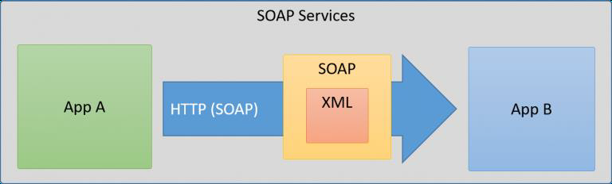
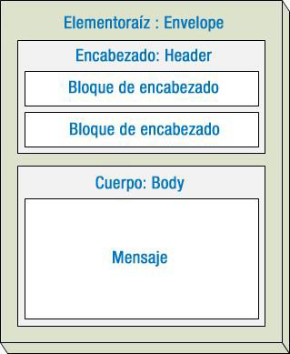
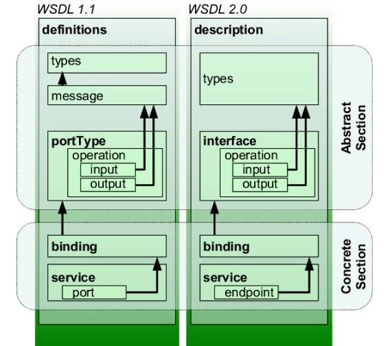
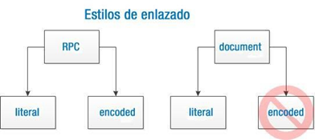
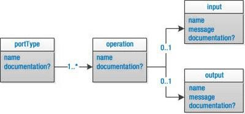
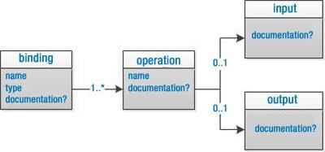
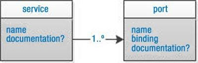
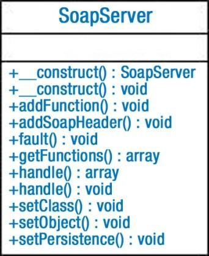
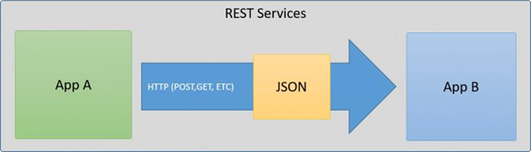

# UT7 PROGRAMACIÓN DE SERVICIOS WEB
## índice
- [UT7 PROGRAMACIÓN DE SERVICIOS WEB](#ut7-programación-de-servicios-web)
  - [índice](#índice)
  - [Introducción](#introducción)
  - [Servicios Web](#servicios-web)
  - [Mecanismos y protocolos implicados](#mecanismos-y-protocolos-implicados)
  - [SOAP](#soap)
    - [Petición SOAP](#petición-soap)
    - [Respuesta SOAP](#respuesta-soap)
    - [Estructura de un mensaje SOAP](#estructura-de-un-mensaje-soap)
  - [WSDL](#wsdl)
    - [Estructura de un documento WSDL](#estructura-de-un-documento-wsdl)
      - [WSDL-types](#wsdl-types)
      - [WSDL-Message](#wsdl-message)
      - [WSDL-PortType](#wsdl-porttype)
      - [WSDL-Binding](#wsdl-binding)
      - [WSDL-Service](#wsdl-service)
  - [PHP SOAP](#php-soap)
  - [Servicios web REST](#servicios-web-rest)
    - [Cliente](#cliente)
    - [Servidor](#servidor)

## Introducción
En ocasiones, las aplicaciones que desarrolles necesitarán compartir información con otras aplicaciones o puede ser que, una vez que esté finalizada y funcionando, quieras programar una nueva aplicación (y no necesariamente una aplicación web)

Para compartir la información que gestiona tu aplicación, normalmente es suficiente con dar acceso a la base de datos en que se almacena. Pero esta generalmente no es una buena idea. Cuantas más aplicaciones utilicen los mismos datos, más posibilidades hay de que se generen errores en los mismos. Además, existen otros inconvenientes:

* Si ya tienes una aplicación funcionando, ya has programado la lógica de negocio correspondiente, y ésta no se podrá aprovechar en otras aplicaciones si utilizan directamente la información almacenada en la base de datos.

* Si quieres poner la base de datos a disposición de terceros, éstos necesitarán conocer su estructura Y al dar acceso directo a los datos, será complicado mantener el control sobre las modificaciones que se produzcan en los mismos.

<div class="page"/>

## Servicios Web
Para facilitar esta tarea existen los servicios web.

__Un servicio web__ es un método que permite que dos equipos intercambien información a través de una red informática.
Al utilizar servicios web, el servidor puede ofrecer __un punto de acceso__ a la información que quiere compartir. De esta forma __controla y facilita el acceso__ a la misma por parte de otras aplicaciones.

__Los clientes del servicio__, por su parte, no necesitan conocer la estructura interna de almacenamiento. En lugar de tener que programar un mecanismo para localizar la información, tienen un __punto de acceso directo__ a la que les interesa.

## Mecanismos y protocolos implicados
¿Qué protocolos de red conocéis? FTP, HTTP, SMTP, POP 3 TELNET, etc.

En todos estos protocolos se definen un servidor y un cliente pero no han sido diseñados para transportar peticiones de información genéricas entre aplicaciones.

Sin embargo, ya desde hace tiempo existen otras soluciones para este tipo de problemas. Una de las más populares es __RPC__

El protocolo RPC se creó para permitir a un sistema acceder de forma remota a funciones o procedimientos que se encuentren en otro sistema El cliente se conecta con el servidor, y le indica qué función debe ejecutar. El servidor la ejecuta y le devuelve el resultado obtenido. Así, por ejemplo, podemos crear en el servidor RPC una función que reciba un código de producto y devuelva su PVP.

Los servicios web se crearon para permitir el intercambio de información al igual que RPC, pero sobre la base del protocolo HTTP (de ahí el término web).

En lugar de definir su propio protocolo para transportar las peticiones de información, utilizan HTTP para este fin. La respuesta obtenida no será una página web, sino la información que se solicitó. De esta forma pueden funcionar sobre cualquier servidor web y, lo que es aún más importante, utilizando el puerto 80 reservado para este protocolo.

Por tanto, cualquier ordenador que pueda consultar una página web, podrá también solicitar información de un servicio web.

Pero...

* ¿Cómo se transmite la información? Es decir, ¿cómo hace el cliente para indicar que quiere conocer el PVP del artículo con código X?, y también, ¿cómo envía el servidor la respuesta obtenida? __PROTOCOLO SOAP__

* ¿Cómo se publican las funciones a las que se puede acceder en un servidor determinado?
Es decir, el cliente puede saber que la función del servidor que tiene que utilizar se llama getPVPArticulo y que debe recibir como parámetro el código del artículo. Pero si no lo sabe, sería útil que hubiera un mecanismo donde pudiera consultar las funciones que existen en el servidor y cómo se utiliza cada una. __WSDL__

## SOAP
SOAP es un protocolo que indica cómo deben ser los mensajes que se intercambien el servidor y el cliente, cómo deben procesarse éstos, y cómo se relacionan con el protocolo que se utiliza para transportarlos de un extremo a otro de la comunicación (en el caso de los servicios web, este protocolo será HTTP)

Aunque nosotros vamos a utilizar HTTP para transmitir la información, SOAP no requiere el uso de un protocolo concreto para transmitir la información.

SOAP se limita a definir las reglas que rigen los mensajes que se deben intercambiar el cliente y el servidor. Cómo se envíen esos mensajes no es relevante desde el punto de vista de SOAP. En lugar de utilizar HTTP para transmitirlos, se podrían utilizar, por ejemplo, correos electrónicos (claro que en este caso ya no sería un servicio web).



### Petición SOAP
Veamos un ejemplo: se realiza una solicitud GetStockPrice se envía a un servidor. La solicitud tiene un parámetro StockName, y un parámetro de precio que se devuelve en la respuesta. El espacio de nombres para la función se define en "http://www.example.org/stock" :

```xml
<?xml version="1.0"?>

<soap:Envelope
xmlns:soap="http://www.w3.org/2003/05/soap-envelope/"
soap:encodingStyle="http://www.w3.org/2003/05/soap-encoding">

<soap:Body xmlns:m="http://www.example.org/stock">
  <m:GetStockPrice>
    <m:StockName>IBM</m:StockName>
  </m:GetStockPrice>
</soap:Body>

</soap:Envelope>

```
<div class="page"/>

### Respuesta SOAP

```xml
<?xml version="1.0"?>

<soap:Envelope
xmlns:soap="http://www.w3.org/2003/05/soap-envelope/"
soap:encodingStyle="http://www.w3.org/2003/05/soap-encoding">

<soap:Body xmlns:m="http://www.example.org/stock">
  <m:GetStockPriceResponse>
    <m:Price>34.5</m:Price>
  </m:GetStockPriceResponse>
</soap:Body>

</soap:Envelope>
```
### Estructura de un mensaje SOAP



En un mensaje SOAP, como mínimo debe figurar __un elemento Envelope__ , que es lo que identifica al documento XML como un mensaje SOAP, y donde se deben declarar al menos los siguientes espacios de nombres:

```xml
<soap:Envelope
xmlns:soap="http://www.w3.org/2003/05/soap-envelope/"
soap:encodingStyle="http://www.w3.org/2003/05/soap-encoding">
```
El espacio de nombres que se utilice para el elemento Envelope indica la versión del protocolo SOAP utilizado. En la versión 1.1, el espacio de nombres es http://schemas.xmlsoap.org/soap/envelope/ En la versión 1.2 se debe utilizar http://www.w3.org/2003/05/soap-envelope

Al cambiar la versión de SOAP, también se deben cambiar los espacios de nombres relativos al estilo de codificación. En la versión 1.1, se debe utilizar http://schemas.xmlsoap.org/soap/encoding/encoding/, y en la versión 1.2 http://www.w3.org/2003/05/soap-encoding

Como primer miembro del elemento Envelope puede haber de forma opcional __un elemento Header__. Si existe, puede contener varios elementos con información adicional sobre cómo procesar el mensaje SOAP. A continuación debe figurar obligatoriamente __un elemento Body__ que es dónde se incluye, dependiendo del tipo de mensaje, la petición o la respuesta.

Sería muy complejo programar un servicio web que procesase el XML recibido en cada petición SOAP, y generase el XML relativo a cada respuesta correspondiente. Existen mecanismos de ayuda que nos evitan tener que tratar con las interioridades del protocolo SOAP.

De las implementaciones de SOAP que podemos usar con PHP, cabe destacar tres: NuSOAP, PEAR::SOAP y PHP SOAP. Las tres nos permiten crear tanto un cliente como un servidor SOAP.

Básicamente las características que las diferencias son:

* __PHP SOAP__ es la implementación de SOAP que se incluye con PHP a partir de la versión 5 del lenguaje. En versiones anteriores se tenía que recurrir a otras opciones para trabajar con SOAP. Es una extensión nativa (escrita en lenguaje C) y por tanto más rápida que las otras posibilidades. Su gran inconveniente es que no permite la generación automática del documento WSDL una vez programado el servidor SOAP correspondiente.

* __NuSOAP__ es un conjunto de clases programadas en PHP que ofrecen muchas funcionalidades para utilizar SOAP. Al contrario que PHP SOAP, funcionan también con PHP 4 y además permite generar automáticamente el documento WSDL correspondiente a un servicio web.

* __PEAR::SOAP__ es un paquete PEAR que permite utilizar SOAP con PHP a partir de su versión 4 Al igual que NuSOAP también está programado en PHP.

La extensión PHP SOAP viene incluida con el lenguaje a partir de su versión 5.

Para poder usar la extensión, hay que comprobar si ya se encuentra disponible (por ejemplo, consultando la salida obtenida por la función phpinfo.Si no estuviese disponible vamos al fichero php ini y buscamos la línea extension soap y la descomentamos. Reiniciamos Apache y volvemos a comprobar el phpinfo. 

Las dos clases principales que deberás utilizar en tus aplicaciones son [__SoapClient__](https://www.php.net/manual/es/class.soapclient.php) y [__SoapServer__](https://www.php.net/manual/es/class.soapserver.php). La primera te permitirá comunicarte con un servicio web, y con la segunda podrás crear tus propios servicios.

Nosotros vamos a comenzar viendo cómo crear en PHP una aplicación que se comunique con un servicio web para obtener información. Utilizaremos algún servicio web disponible en la red y posteriormente aprenderemos a crear los nuestros.

Para crear un cliente del servicio, habrá que conocer los detalles del mismo (como mínimo, los parámetros de entrada y salida a usar, y cuál es la URL del servicio) y emplearlo en tu código la clase SoapClient.

Para nuestro ejemplo utilizaremos un servicio web que nos muestra el nombre de cada alumno de DAW2:
http://ejercicios.soap.es/alumnos/DAW2Server.php

De momento no conocemos la estructura del servicio web. El servicio tendrá una función llamada getAlumno que recibirá el identificador del usuario del dominio (por ejemplo).

Con la información anterior, para utilizar el servicio desde PHP creas un nuevo objeto de la clase SoapClient . Como el servicio no tiene un documento WSDL asociado, en él le pasamos los siguientes datos:

```php
<?php

$location= "http://ejercicios.soap.es/alumnos/DAW2Server.php";
$uri ="http://ejercicios.soap.es/alumnos/";
$cliente = new SoapClient(null, array('location'=>$location,'uri'=>$ur));
echo " el alumnos daw200 es ".$cliente->getAlumno("daw200");
?>

```
Todo lo anterior podéis meterlo dentro de un bloque try y capturar una posible excepción del tipo [SoapFault](https://www.php.net/manual/es/class.soapfault.php)

Si usamos un documento WSDL para acceder al servicio web, la clase SoapClient implementa dos métodos que muestran parte de la información que contiene concretamente, los tipos de datos definidos por el servicio, y las funciones que ofrece. Para conocer esta información, una vez creado el objeto, debes utilizar los métodos __getTypes__ y __getFunctions__ respectivamente.

La extensión PHP SOAP también incluye opciones de depuración muy útiles para averiguar qué está pasando cuando la conexión al servicio web no funciona como debería. Para habilitarlas, cuando hagas la llamada al constructor de la clase SoapClient debes utilizar la opción trace en el array de opciones del segundo parámetro. Se puede utilizar trace igual a true o igual a 1.

```php
$cliente = new SoapClient(null, array('location'=>$location,'uri'=>$uri,'trace'=>true));
```

Una vez activada la depuración, podrás utilizar los siguientes métodos para revisar.

| Método | Significado |
| ------------- | ------------------------------ |
| __getLastRequest__  | Devuelve el XML correspondiente a la última petición enviada|
| __getLastRequestHeaders__  | Devuelve el XML correspondiente a los encabezados de la última petición|
| __getLastResponse__  | Devuelve el XML correspondiente a la última respuesta recibida|
| __getLastResponseHeaders__  | Devuelve el XML correspondiente a los encabezados de la última respuesta recibida|

El constructor de la clase SoapClient puede usarse de dos formas indicando un documento WSDL, o sin indicarlo:

* En el primer caso, la extensión SOAP examina la definición del servicio y establece las opciones adecuadas para la
comunicación, con lo cual el código necesario para utilizar un servicio es bastante simple.
```php
$cliente = new SoapClient($wsdl);
```

* En el segundo caso, si no indicas en el constructor un documento WSDL (bien porque no existe, o porque necesitas configurar manualmente alguna opción), el primer parámetro debe ser null y las opciones para comunicarse con el servicio las tendrás que establecer en un array que se pasa como segundo parámetro.
```php
$cliente = new SoapClient(null, array('location'=>$location,'uri'=>$uri);
```
:computer: Hoja07_Ejemplo
:computer: Hoja07_WebServices_01

<div class="page"/>

## WSDL
A partir de ahora vamos a desarrollar nuestros propios servicios web.

Para que un servicio web sea accesible a aplicaciones desarrolladas por otros programadores, habrá que indicarles cómo usarlo, es decir, crear un documento WSDL que describa el servicio.

WSDL es un lenguaje basado en XML que utiliza unas reglas determinadas para generar el documento de descripción de un servicio web. Una vez generado, ese documento se suele poner a disposición de los posibles usuarios del servicio(normalmente se accede al documento WSDL añadiendo?wsdl ala URL del servicio).

El espacio de nombresde un documento WSDL es http://schemas.xmlsoap.org/wsdl, aunque en un documento WSDL se suelen utilizar también otros espacios de nombres.

### Estructura de un documento WSDL



<div class="page"/>

```xml
<definitions name ="…"
targetNamespace ="http://…"
xmlns:tns ="http://…"
xmlns ="http://schemas.xmlsoap.org/wsdl/"
… >
<types> … </types>
<message > … </message>
<portType > … </portType>
<binding > … </binding>
<serviceservice> … </service>
</definitions>
```
El objetivo de cada una de las secciones del documento es el siguiente:
* __types__: incluye las definiciones de los tipos de datos que se usan en el servicio.
* __message__: define conjuntos de datos, como la lista de parámetros que recibe una función o los valores que devuelve.
* __portType__: cada portType es un grupo de funciones que implementa el servicio web. Cada función se define dentro de su portType como una operación (operation).
* __binding__: define cómo va a transmitirse la información de cada portType.
* __service__: contiene una lista de elementos de tipo port. Cada port indica dónde (en qué URL) se puede	acceder al servicio web.

#### WSDL-types
Para crear y utilizar servicios web, hay que definir los tipos de elementos que se transmiten: de qué tipo son los valores del array, o qué miembros poseen los objetos que maneja. La definición de tipos en WSDL se realiza utilizando la __etiqueta types__.

Existen servicios web sencillos a los que se pueden pasar como parámetro un número o una cadena de texto, y devuelven también un dato de un tipo simple, como un número decimal. E igualmente existen también servicios web más elaborados, que pueden requerir o devolver un array de elementos, o incluso objetos.

En el siguiente código, se definen dos tipos de datos usando XML Schema: __direccion  y usuario__. De hecho, los tipos dirección y usuario son la forma en que se definen en WSDL las clases para transmitir la información de sus objetos.

En WSDL, las clases se definen utilizando los tipos complejos de XML Schema. Al utilizar __all__ dentro del tipo complejo, estamos indicando que la clase contiene esos miembros, aunque no necesariamente en el orden que se indica(si en lugar de all hubiésemos utilizado __sequence__, el orden de los miembros de la clase debería ser el mismo que figura en el documento).

<div class="page"/>

```xml
<types>
  <xsd:schema targetNamespace="http://ejercicios.soap.es/usuarios/">
    <xsd:complexType name="direccion">
      <xsd:all>
        <xsd:element name="ciudad" type="xsd:string"/>
        <xsd:element name="calle" type="xsd:string"/>
        <xsd:element name="numero" type="xsd:string"/>
        <xsd:element name="piso" type="xsd:string"/>
        <xsd:element name="CP" type="xsd:string"/>
      </xsd:all>
    </xsd:complexType>
    <xsd:complexType name="usuario">
      <xsd:all>
        <xsd:element name="id" type="xsd:int"/>
        <xsd:element name="nombre" type="xsd:string"/>
        <xsd:element name="direccion" type="tns:direccion"/>
        <xsd:element name="email" type="xsd:string"/>
      </xsd:all>
    </xsd:complexType>
  </xsd:schema>
</types>
```
El otro tipo de datos que necesitaremos definir en los documentos WSDL son los __arrays__. Para definir un array, no existe en el XML Schema un tipo base adecuado que podamos usar. En su lugar, se utiliza el tipo Array definido en el esquema enconding de SOAP. Por ejemplo, podríamos añadir un tipo array de usuarios al documento anterior haciendo:
```xml
<xsd:complexType name="ArrayOfusuario">
  <xsd:complexContent>
    <xsd:restriction base="soapenc:Array">
      <xsd:attribute ref="soapenc:arrayType" arrayType="tns:usuario[]" />
    </xsd:restriction>
  </xsd:complexContent>
</xsd:complexType>
```
En muchas  ocasiones no será necesario definir tipos propios, y por tanto en el documento WSDL no habrá sección types; será suficiente con utilizar alguno de los tipos propios de XML Schema, como xsd:string, xsd:float o xsd:boolean.

#### WSDL-Message

El siguiente paso es indicar cómo se agrupan los tipos para formar los parámetros de entrada y de salida.
Siguiendo con los usuarios que acabamos de definir, podríamos crear en el servicio web una función getUsuario para dar acceso a los datos de un usuario.
Como parámetro de entrada de esa función vamos a pedir el id del usuario, y como valor de salida se obtendrá un objeto usuario. Por tanto, debemos definir los siguientes mensajes:

<div class="page"/>

```xml
<message name="getUsuarioRequest">
  <part name="id" type="xsd:int"/>
</message>
<message name="getUsuarioResponse">
  <part name="getUsuarioReturn" type="tns:usuario"/>
</message>
```
Normalmente por cada función del servicio web se crea un mensaje para los parámetros de entrada, y otro para los de salida. Dentro de cada mensaje, se incluirán tantos elementos part como sea necesario. Cada mensaje contendrá un atributo name que debe ser único para todos los elementos de este tipo.

Además, es aconsejable que el nombre del mensaje con los parámetros de entrada acabe en __Request__, y el correspondiente a los parámetros de salida en __Response__.

Por último, mencionar que un documento WSDL podemos especificar dos estilos de enlazado: __document__ o __RPC__. La selección que hagamos influirá en cómo se transmitan los mensajes dentro de las peticiones y respuestas SOAP.

Además, cada estilo de enlazado puede ser de tipo __encoded__ o __literal__ (aunque en realidad la combinación document/encoded no se utiliza). Al indicar __encoded__, estamos diciendo que vamos a usar un conjunto de reglas de codificación, como las que se incluyen en el propio  protocolo SOAP [espacio de nombres] (http://schemas.xmlsoap.org/soap/encoding/), para convertir en XML los parámetros de las peticiones y respuestas.
Nosotros trabajaremos únicamente con estilo de enlazado __RPC/encoded__



#### WSDL-PortType
Las funciones que creas en un servicio web, se conocen con el nombre de __operaciones__ en un documento WSDL.

En lugar de definirlas una a una, es necesario agruparlas en lo que en WSDL se llama __portType__. Un portType contiene una lista de funciones, indicando para cada función (__operation__) la lista de parámetros de entrada y de salida que le corresponden.

<div class="page"/>

```xml
<portType name="usuarioPortType">
  <operation name="getUsuario">
    <input message="tns:getUsuarioRequest"/>
    <output message="tns:getUsuarioResponse"/>
  </operation>
</portType>
```
Normalmente a no ser que estemos generando un servicio web bastante complejo, el documento WSDL contendrá un único __portType__



Cada __portType__ debe contener un atributo __name__ con el nombre (único para todos los elementos portType). Cada elemento __operation__ también debe contener un atributo __name__, que se corresponderá con el nombre de la función que se ofrece. Además, en función del tipo de operación de que se trate, contendrá:
* Un elemento input para indicar funciones que no devuelven valor (su objetivo es sólo enviar un mensaje al servidor).
* Un elemento input y otro output, en este orden, para el caso más habitual: funciones que reciben algún parámetro, se ejecutan, y devuelven un resultado.

Es posible (aunque muy extraño) encontrase funciones a la inversa: sólo con un parámetro output (el servidor envía una notificación al cliente) o con los parámetros output e input por ese orden (el servidor le pide al cliente alguna información).

Por tanto, al definir una función (un elemento __operation__) se debe tener cuidado con el orden de los elementos input y output.

Normalmente, los elementos input y output contendrán un atributo __message__ para hacer referencia a un mensaje definido anteriormente.

#### WSDL-Binding

Antes comentábamos que existían distintos estilos de enlazado, que influían en cómo se debían crear los mensaje. En el elemento __binding__ se debe indicar que el estilo de enlazado de tu documento sea __RPC/encoded__.

Aunque es posible crear documentos WSDL con varios elementos binding, la mayoría contendrán solo uno (si no fuera así, sus atributos name deberán ser distintos).
En él, para cada una de las funciones (__operation__) del portType que acabamos de crear, se deberá indicar cómo se codifica y transmite la información.



Para el portType anterior, podemos crear un elemento binding como el siguiente:
```xml
<binding name="usuarioBinding" type="tns:usuarioPortType">
  <soap:binding style="rpc" transport="http://schemas.xmlsoap.org/soap/http"/>
    <operation name="getAlumno">
      <soap:operation soapAction="http://ejercicios.soap.es/usuarios/Usuario.php?getUsuario" style="rpc"/>
      <input>
        <soap:body use="encoded" encodingStyle="http://schemas.xmlsoap.org/soap/encoding/"/>
      </input>
      <output>
        <soap:body use="encoded" encodingStyle="http://schemas.xmlsoap.org/soap/encoding/"/>
      </output>
    </operation>
</binding>
```

Fíjate que el atributo __type__ hace referencia al __portType__ creado anteriormente. El siguiente elemento indica el tipo de codificación (__RPC__) y, mediante la URL correspondiente, el protocolo de transporte a utilizar (__HTTP__)

El elemento __soap:operation__ debe contener un atributo __soapAction__ con la URL para esa función (__operation__)en particular. Dentro de él habrá normalmente un elemento __input__ y otro __output__ (los mismos que en la __operation__ correspondiente). En ellos, mediante los atributos del elemento __soap:body__, se indica el estilo concreto de enlazado (encoded con su encondingStyle correspondiente).

#### WSDL-Service

Por último, falta definir el elemento __service__. Normalmente sólo encontraremos un elemento service en cada documento WSDL. En él, se hará referencia al binding anterior utilizando un elemento port, y se indicará la URL en la que se puede acceder al servicio.

<div class="page"/>

```xml
<service name="usuario">
  <port name="usuarioPort" binding="tns:usuarioBinding">
    <soap:address location="http://ejercicios.soap.es/usuarios/Usuario.php" />
  </port>
</service>
```


## PHP SOAP
En PHP SOAP, para crear un servicio web, hay que utilizar la clase [__SoapServer__](https://www.php.net/manual/es/class.soapserver.php). 



<div class="page"/>

Veamos un ejemplo sencillo:

```php
function suma($a,$b){ return $a+$b; }  
function resta($a,$b){ return $a-$b; }

$uri="http://localhost/URIEspacioNombres";

$server = new  SoapServer(null,array('uri'=>$uri));
$server->addFunction("suma");
$server->addFunction("resta");
$server->handle();
```
El código anterior crea un servicio web con dos funciones: suma y resta.
Cada función recibe dos parámetros y devuelve un valor.

Para consumir este servicio, habría que escribir el siguiente código:

```php
$url="http://localhost/URLDelServicio";
$uri="http://localhost/URIEspacioNombres";

$cliente = new SoapClient(null,array('location'=>$url,'uri'=>$uri));

$suma  = $cliente->suma(2,3);
$resta = $cliente->resta(2,3);
print("La suma es ".$suma);  
print("<br />La resta es ".$resta);
```
El servicio creado no incluye un documento WSDL para describir sus funciones. Sabes que existen los métodos __suma y resta__, y los parámetros que debes utilizar con ellos, porque conoces el código interno del servicio.

Un usuario que no tuviera esta información, no sabría cómo consumir el servicio.

Al igual que sucedía con SoapClient al programar un cliente, cuando se utiliza SoapServer se puede crear un servicio sin documento WSDL asociado (como en el caso anterior), o indicar el documento WSDL correspondiente al servicio.

El primer parámetro del constructor indica la ubicación del WSDL correspondiente.

El segundo parámetro es una colección de opciones de configuración del servicio. Si existe el primer parámetro, ya no hace falta más información. PHP5 SOAP utiliza la información del documento WSDL para ejecutar el servicio. Si, como en el ejemplo, no existe WSDL, hay que indicar en el segundo parámetro al menos la opción uri, con el espacio de nombres destino del servicio.

Además, en el código anterior se utiliza los métodos __addFunction__ y __handle__. El  primero se encarga de publicar en el servicio la función que se le pase como parámetro. El método handle es el encargado de procesar las peticiones, recogiendo los datos que se reciban utilizando POST por HTTP.

Para crear un documento WSDL de descripción del servicio, habrá que seguir los pasos vistos anteriormente.
Al programar un servicio web, es importante cambiar en el fichero __php.ini__ la directiva  __soap.wsdl_cache_enabled a 0__. En caso contrario, con su valor por defecto (1) los cambios que realices en los ficheros WSDL no tendrán efecto de forma inmediata.

Después iremos generando cada una de las secciones del documento WSDL.

En vez de utilizar funciones para la lógica interna del servicio web, como la suma y la resta del ejemplo anterior, es aconsejable definir una clase que implemente los métodos que queramos publicar en el servicio.

```php
class Calcula {
public function suma($a, $b){ return $a+$b; }  
public function resta($a, $b){ return $a-$b; }
}
```
Al hacerlo de esta forma, en lugar de añadir una a una las funciones,  podemos añadir la clase completa al servidor utilizando el método __setClass__ de SoapServer.

```php
require_once('Calcula.php');
$server = new SoapServer(null, array('uri'=>''));
$server->setClass('Calcula');
$server->handle();
```

Aunque como ya sabes, PHP SOAP no genera el documento WSDL de forma automática para los servicios que crees, existen algunos mecanismos que nos permiten generarlo, aunque siempre es aconsejable revisar los resultados obtenidos antes de publicarlos. Una de las formas más sencillas es utilizar la librería __WSDLDocument__.

Esta librería revisa los comentarios que hayas añadido al código de la clase que quieras a publicar (debe ser una clase, no funciones aisladas), y genera como salida el documento WSDL correspondiente. Para que funcione correctamente, es necesario que los comentarios de las clases sigan un formato específico: el mismo que utiliza la herramienta de documentación [__PHPDocumentor__](https://www.phpdoc.org/).

PHPDocumentor es una herramienta de código libre para generación automática de documentación, similar a Javadoc(para el lenguaje Java).
Si comentamos el código de nuestras aplicaciones siguiendo unas normas, PHPDocumentor es capaz de generar, a partir de los comentarios que introduzcamos en el código mientras programamos, documentación en diversos formatos (HTML,PDF,XML).

Los comentarios se deben ir introduciendo en el código distribuidos en bloques, y utilizando ciertas marcas  específicas como @param para indicar un parámetro y @return para indicar el valor devuelto por una función.

Existe una extensión de visual studio code que nos ayuda también a generar los comentarios [PHPDoc Generator](https://marketplace.visualstudio.com/items?itemName=ronvanderheijden.phpdoc-generator)

<div class="page"/>

Un ejemplo de la clase Calcula sería el siguiente:
```php
<?
/**
 * Descripcion de la clase
 * @author cic
 */
class Calcula{
    /**
     * suma dos numeros
     * @param mixed $a
     * @param mixed $b
     * 
     * @return [float]
     */
    public function suma($a,$b){
        return $a+$b;
    }

    /**
     * resta dos numeros
     * @param mixed $a
     * @param mixed $b
     * 
     * @return [float]
     */
    public function resta($a,$b){
        return $a-$b;
    }
}
?>
```
Utilizaremos el fichero __WSDLDocument.php__ entregado en el ejemplo Hoja07_ejemplo.

Para generar el documento WSDL a partir de la clase Calcula anterior, debes crear un nuevo fichero con el siguiente código:
```php
require_once 'Calcula.php';
require 'WSDLDocument.php';
$wsdl = new  WSDLDocument('Calcula','http://localhost/URLDelServicio.php', 'http://localhost/URIEspacioNombres');
$wsdl->formatOutput = true;
header('Content-Type: text/xml');
echo $wsdl->saveXML();
```
:computer: Hoja07_WebServices_02
:computer: Hoja07_WebServices_03


## Servicios web REST

REST es una tecnología mucho más flexible que transporta datos por medio del protocolo HTTP.

Además permite utilizar los diversos métodos que proporciona HTTP para comunicarse, como lo son GET, POST, PUT, DELETE, PATCH.

Permite transmitir prácticamente __cualquier tipo de datos__, ya que el tipo de datos está definido por el Header Content-Type, lo que nos permite mandar, XML, JSON, binarios (imágenes o documentos),  text, etc.
* La gran mayoría transmite en JSON por un motivo muy importante: JSON es interpretado de forma natural por JavaScript
  
REST es más liviano en peso y mucho más rápido en su procesamiento que SOAP.


### Cliente
Para obtener los datos del un servicio web REST se utiliza la [__librería cURL__](https://www.php.net/manual/es/book.curl.php). Es una biblioteca que permite conectarse y comunicarse con diferentes tipos de servidores y diferentes tipos de protocolos.

Un ejemplo de una petición GET podría ser la siguiente:
```php
    $url_servicio = "http://zoologico.laravel/rest";
    $curl = curl_init($url_servicio);
    //establecemos el verbo http que queremos utilizar para la petición
    curl_setopt($curl, CURLOPT_CUSTOMREQUEST, "GET");
    curl_setopt($curl, CURLOPT_RETURNTRANSFER, true);
    $respuesta_curl = curl_exec($curl);
    curl_close($curl);
	
    $respuesta_decodificada = json_decode($respuesta_curl);
```

### Servidor

La idea es generar una página que devuelva una respuesta en formato JSON.
Para ello se puede utilizar el método __json__ de Laravel. 
Se crea un __controlador__ específico y las __rutas__ correspondientes.
Luego, en el controlador se hacen los __métodos__ necesarios para realizar todas las operaciones del servicio web.

Por ejemplo, si queremos devolver en formato JSON todos los animales  de nuestro zoologico, podemos hacer algo así:
```php
$animales=Animal::all();
return response()->json($animales);
```
Si quisiéramos enviar un mensaje lo haríamos a través de un array asociativo:
```php
return response()->json(['mensaje' => ‘El mensaje a enviar’]);
```
:computer: Hoja07_WebServices_04